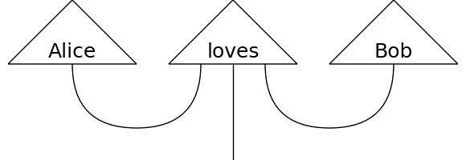

[](https://discopy.readthedocs.io/)
[](https://travis-ci.com/oxford-quantum-group/discopy)
[](https://codecov.io/gh/oxford-quantum-group/discopy)
[](https://www.pylint.org/)



# Distributional Compositional Python

`discopy` computes natural language meaning in pictures.

## Recipe

```python
# 1) Draw your picture.

from discopy import Ty, Word, Cup, Id

s, n = Ty('s'), Ty('n')
Alice, Bob = Word('Alice', n), Word('Bob', n)
loves = Word('loves', n.r @ s @ n.l)

sentence = Alice @ loves @ Bob >> Cup(n, n.r) @ Id(s) @ Cup(n.l, n)


# 2) Define a model.

from discopy import Model

ob = {s: 1, n: 2}
ar = {Alice: [1, 0], loves: [0, 1, 1, 0], Bob: [0, 1]}
F = Model(ob, ar)


# 3) Compute the meaning!

assert F(sentence)
```

## Requirements

* [numpy](https://numpy.org/)
* [networkx](https://networkx.github.io/)
* [matplotlib](https://matplotlib.org/)
* [pytket](https://github.com/CQCL/pytket)

## Getting Started

```shell
pip install discopy
```

## Documentation

The documentation is hosted at [readthedocs.io](https://discopy.readthedocs.io/),
you can also checkout the [notebooks](notebooks/) for a demo!

## References

* [Pregroup grammars](https://ncatlab.org/nlab/show/pregroup+grammar) and [categorical compositional distributional semantics](https://ncatlab.org/nlab/show/categorical+compositional+distributional+semantics) on the [nLab](https://ncatlab.org/)
* [From Word to Sentence: A Computational Algebraic Approach to Grammar](http://www.math.mcgill.ca/barr/lambek/pdffiles/2008lambek.pdf) - Lambek (2008)
* [A Compositional Distributional Model of Meaning](http://citeseerx.ist.psu.edu/viewdoc/download?doi=10.1.1.363.8703&rep=rep1&type=pdf) - Clark, Coecke, Sadrzadeh (2008)
* [Experimental Support for a Categorical Compositional Distributional Model of Meaning](https://arxiv.org/abs/1106.4058) - Grefenstette and Sadrzadeh (2010)
* [Functorial Question Answering](https://arxiv.org/abs/1905.07408) - De Felice, Meichanetzidis, Toumi (2019)
* [The Mathematics of Text Structure](https://arxiv.org/abs/1904.03478) - Coecke (2019)
