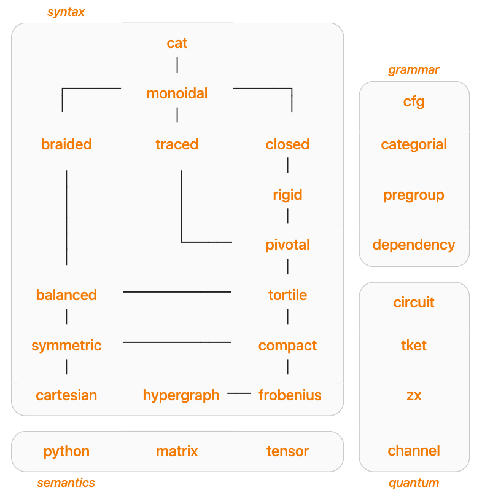

# DisCoPy

[](https://github.com/oxford-quantum-group/discopy/actions/workflows/build_test.yml)
[](https://discopy.readthedocs.io/)
[](https://badge.fury.io/py/discopy)
[](https://doi.org/10.4204/EPTCS.333.13)

DisCoPy is a Python toolkit for computing with [string diagrams](https://en.wikipedia.org/wiki/String_diagram).

* **Organisation:** https://www.discopy.org
* **Documentation:** https://discopy.readthedocs.io
* **Source code:** https://github.com/oxford-quantum-group/discopy
* **Paper (for applied category theorists):** https://doi.org/10.4204/EPTCS.333.13
* **Paper (for quantum computer scientists):** https://arxiv.org/abs/2205.05190

DisCoPy began as an implementation of [DisCoCat](https://en.wikipedia.org/wiki/DisCoCat) and [QNLP](https://en.wikipedia.org/wiki/Quantum_natural_language_processing). This application has now been packaged into its own library, [lambeq](https://cqcl.github.io/lambeq/).

## Features

* a data structure for arrows in free [dagger categories](https://en.wikipedia.org/wiki/Dagger_category) with formal sums, unary operators and symbolic variables from [SymPy](https://www.sympy.org/en/index.html)
* data structures for diagrams in the hierarchy of graphical languages
* methods for diagram composition, drawing, rewriting and evaluation as:
  - Python code, i.e. wires as types and boxes as functions
  - matrices, i.e. wires as dimensions and boxes as arrays from:
    - [NumPy](https://numpy.org)
    - [JAX](https://github.com/google/jax)
    - [PyTorch](https://pytorch.org/)
    - [TensorFlow](https://www.tensorflow.org/)
    - [TensorNetwork](https://github.com/google/TensorNetwork)
* an implementation of classical-quantum circuits with interfaces to:
  - [tket](https://github.com/CQCL/tket) for compilation
  - [PyZX](https://github.com/Quantomatic/pyzx) for optimisation
  - [PennyLane](https://pennylane.ai/) for differentiation
* encodings of grammars ([formal](https://en.wikipedia.org/wiki/Formal_grammar), [categorial](https://en.wikipedia.org/wiki/Categorial_grammar) and [pregroup](https://en.wikipedia.org/wiki/Pregroup_grammar)) as diagrams

## Summary

[](https://discopy.readthedocs.io#summary)

## Install

```shell
pip install discopy
```

## Test

If you want the bleeding edge, you can install DisCoPy locally:

```shell
git clone https://github.com/oxford-quantum-group/discopy.git
cd discopy
pip install .
```

You should check you haven't broken anything by running the test suite:

```shell
pip install ".[test]" .
coverage run -m pytest --doctest-modules --pycodestyle
coverage report -m discopy/*.py discopy/*/*.py
```

The documentation is built using
[sphinx](https://www.sphinx-doc.org/en/master/).
You can build it locally with:

```shell
pip install ".[docs]" .
sphinx-build docs docs/_build/html
```

## Contribute

Contributions are welcome, please get in touch or
[open an issue](https://github.com/oxford-quantum-group/discopy/issues/new).

## How to cite

If you wish to cite DisCoPy in an academic publication, we suggest you cite:

* G. de Felice, A. Toumi & B. Coecke, _DisCoPy: Monoidal Categories in Python_, EPTCS 333, 2021, pp. 183-197, [DOI: 10.4204/EPTCS.333.13](https://doi.org/10.4204/EPTCS.333.13)

If furthermore your work is related to quantum computing, you can also cite:

* A. Toumi, G. de Felice & R. Yeung, _DisCoPy for the quantum computer scientist_, [arXiv:2205.05190](https://arxiv.org/abs/2205.05190)
