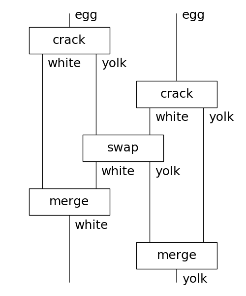

# Distributional Compositional Python
[](https://discopy.readthedocs.io/)
[](https://travis-ci.com/oxford-quantum-group/discopy)
[](https://codecov.io/gh/oxford-quantum-group/discopy)
[](https://www.pylint.org/)
[](https://badge.fury.io/py/discopy)

`discopy` computes natural language meaning in pictures.

## Features

### Diagrams, Recipes & Categories

Diagrams are the core data structure of `discopy`, they are generated
by the following grammar:

```python
diagram ::= Box(name, dom=type, cod=type)
    | diagram @ diagram
    | diagram >> diagram
    | Id(type)

type ::= Ty(name) | type.l | type.r | type @ type | Ty()
```

Mathematically, [string diagrams](https://ncatlab.org/nlab/show/string+diagram) (also called [tensor networks](https://ncatlab.org/nlab/show/tensor+network) or [Penrose notation](https://en.wikipedia.org/wiki/Penrose_graphical_notation)) are a graphical calculus for computing the arrows of the free
[monoidal category](https://ncatlab.org/nlab/show/monoidal+category).
For example, if we take ingredients as types and cooking steps as boxes then a
diagram is a recipe:

```python
from discopy import Ty, Box, Id

egg, white, yolk = Ty('egg'), Ty('white'), Ty('yolk')
crack = Box('crack', egg, white @ yolk)
swap = lambda x, y: Box('swap', x @ y, y @ x)
merge = lambda x: Box('merge', x @ x, x)

crack_two_eggs = crack @ crack\
    >> Id(white) @ swap(yolk, white) @ Id(yolk)\
    >> merge(white) @ merge(yolk)
crack_two_eggs.draw()
```



### Words, Snakes & Functors

There are two special kinds of boxes that allow to bend wires and draw snakes: **cups** and **caps**, which satisfy the **snake equations** or [triangle identities](https://ncatlab.org/nlab/show/triangle+identities).
That is, `discopy` diagrams are the arrows of the free [rigid monoidal category](https://ncatlab.org/nlab/show/rigid+monoidal+category), up to `diagram.normal_form()`.

```python
from discopy import Cup, Cap

x = Ty('x')
left_snake = Id(x) @ Cap(x.r, x) >> Cup(x, x.r) @ Id(x)
right_snake =  Cap(x, x.l) @ Id(x) >> Id(x) @ Cup(x.l, x)
assert left_snake.normal_form() == Id(x) == right_snake.normal_form()
```

In particular, `discopy` allows to draw the grammatical structure of natural language sentences given by reductions in a [pregroup grammar](https://ncatlab.org/nlab/show/pregroup+grammar).

```python
from discopy import pregroup, Word

s, n = Ty('s'), Ty('n')
Alice, Bob = Word('Alice', n), Word('Bob', n)
loves = Word('loves', n.r @ s @ n.l)

sentence = Alice @ loves @ Bob >> Cup(n, n.r) @ Id(s) @ Cup(n.l, n)
pregroup.draw(sentence)
```


We can take strong monoidal functors from the free category to itself.

```python
love_box = Box('loves', n @ n, s)
love_ansatz = Cap(n.r, n) @ Cap(n, n.l) >> Id(n.r) @ love_box @ Id(n.l)
ob, ar = {s: s, n: n}, {Alice: Alice, Bob: Bob, loves: love_ansatz}
F = RigidFunctor(ob, ar)
F(sentence).to_gif('docs/imgs/autonomisation.gif')
```


### Matrices, Circuits & Learners

We can take strong monoidal functors into the category of matrices with tensor product.

```python
from discopy import Model

ob = {s: 1, n: 2}
ar = {Alice: [1, 0], loves: [0, 1, 1, 0], Bob: [0, 1]}
F = Model(ob, ar)

assert F(sentence)
```

## Requirements

* [numpy](https://numpy.org/)
* [networkx](https://networkx.github.io/)
* [matplotlib](https://matplotlib.org/)
* [pytket](https://github.com/CQCL/pytket)

## Getting Started

```shell
pip install discopy
```

## Documentation

The documentation is hosted at [readthedocs.io](https://discopy.readthedocs.io/),
you can also checkout the [notebooks](notebooks/) for a demo!

## References

* [Pregroup grammars](https://ncatlab.org/nlab/show/pregroup+grammar) and [categorical compositional distributional semantics](https://ncatlab.org/nlab/show/categorical+compositional+distributional+semantics) on the [nLab](https://ncatlab.org/)
* [From Word to Sentence: A Computational Algebraic Approach to Grammar](http://www.math.mcgill.ca/barr/lambek/pdffiles/2008lambek.pdf) - Lambek (2008)
* [A Compositional Distributional Model of Meaning](http://citeseerx.ist.psu.edu/viewdoc/download?doi=10.1.1.363.8703&rep=rep1&type=pdf) - Clark, Coecke, Sadrzadeh (2008)
* [Experimental Support for a Categorical Compositional Distributional Model of Meaning](https://arxiv.org/abs/1106.4058) - Grefenstette and Sadrzadeh (2010)
* [Functorial Question Answering](https://arxiv.org/abs/1905.07408) - De Felice, Meichanetzidis, Toumi (2019)
* [The Mathematics of Text Structure](https://arxiv.org/abs/1904.03478) - Coecke (2019)
