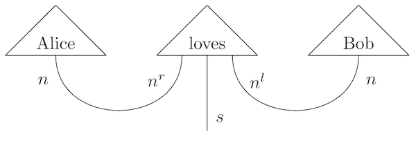

# Distributional Compositional Python

`discopy` computes natural language meaning in pictures.



## Recipe

1) Draw your picture.

```python
from discopy import Ty, Word, Cup, Wire

s, n = Ty('s'), Ty('n')
Alice, Bob = Word('Alice', n), Word('Bob', n)
loves = Word('loves', n.r @ s @ n.l)

sentence = Alice @ loves @ Bob >> Cup(n, n.r) @ Wire(s) @ Cup(n.l, n)
```

2) Define a model.

```python
from discopy import Model

ob = {s: 1, n: 2}
ar = {Alice: [1, 0], loves: [0, 1, 1, 0], Bob: [0, 1]}
F = Model(ob, ar)
```

3) Compute the meaning!

```python
assert F(sentence)
```

## Requirements

* If you just want to play with free categories, there are no requirements.
* If you want to compute matrix-valued functors, you will need [numpy](https://numpy.org/).
* If you want to evaluate quantum circuits for real, you will need [pytket](https://github.com/CQCL/pytket).
* If you want to differentiate your matrix-valued functors, you will need [jax](https://github.com/google/jax).

## Getting Started

Either a) install from pip:

```shell
pip install discopy
```

or b) install from sources:

```
git clone https://github.com/oxford-quantum-group/discopy.git
cd discopy
python setup.py install
```

## Documentation

For now all of it is in the code. You can use `help` if needed:

```python
>>> help(discopy.Ty)

Help on class Ty in module discopy.pregroup:

class Ty(discopy.moncat.Ty)
 |  Ty(*t)
 |
 |  Implements pregroup types as lists of simple types.
 |
 |  >>> s, n = Ty('s'), Ty('n')
 |  >>> assert n.l.r == n == n.r.l
 |  >>> assert (s @ n).l == n.l @ s.l and (s @ n).r == n.r @ s.r
```

You can also checkout the [notebooks](notebooks/) for a demo!

## References

* Lambek (2008) [From Word to Sentence: A Computational Algebraic Approach to Grammar](http://www.math.mcgill.ca/barr/lambek/pdffiles/2008lambek.pdf)
* Clark, Coecke, Sadrzadeh (2008) [A Compositional Distributional Model of Meaning](http://citeseerx.ist.psu.edu/viewdoc/download?doi=10.1.1.363.8703&rep=rep1&type=pdf)
* Grefenstette and Sadrzadeh (2010) [Experimental Support for a Categorical Compositional Distributional Model of Meaning](https://arxiv.org/abs/1106.4058)
* Coecke (2019) [The Mathematics of Text Structure](https://arxiv.org/abs/1904.03478)
* De Felice, Meichanetzidis, Toumi (2019) [Functorial Question Answering](https://arxiv.org/abs/1905.07408)
* [Pregroup grammars](https://ncatlab.org/nlab/show/pregroup+grammar) and [categorical compositional distributional semantics](https://ncatlab.org/nlab/show/categorical+compositional+distributional+semantics) and on the [nLab](https://ncatlab.org/)
