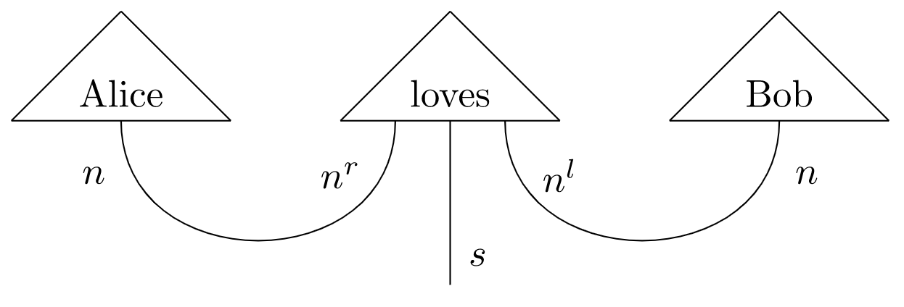

# Distributional Compositional Python

`discopy` computes natural language meaning in pictures.



The recipe goes in three steps:

1) draw the picture

```python
from disco import Pregroup, Word, Cup, Wire

s, n = Pregroup('s'), Pregroup('n')
Alice = Word('Alice', n)
loves = Word('loves', n.r + s + n.l)
Bob = Word('Bob', n)

grammar = Cup(n) @ Wire(s) @ Cup(n.l)
sentence = grammar << Alice @ loves @ Bob
```

2) define a model

```python
from disco import Model

ob = {s: 1, n: 2}
ar = {Alice: [1, 0], loves: [0, 1, 1, 0], Bob: [0, 1]}
F = Model(ob, ar)
```

3) compute the meaning!

```python
assert F(sentence) == True
```

## General Abstract Nonsense

`discopy` is a Python implementation of the categorical compositional distributional (DisCoCat) models, see [arXiv:1003.4394](https://arxiv.org/abs/1003.4394), [arXiv:1106.4058](https://arxiv.org/abs/1106.4058) [arXiv:1904.03478](https://arxiv.org/abs/1904.03478).

* `cat.Arrow`, `cat.Generator` implement free categories.
* `cat.Functor` implements Python-valued functors.
* `moncat.Diagram`, `moncat.Box` implement free monoidal categories.
* `moncat.MonoidalFunctor` implements free monoidal functors.
* `moncat.NumpyFunctor` implements matrix-valued monoidal functors.
* `disco.Pregroup`, `disco.Cup` and `disco.Cap` implement Lambek pregroups.
* `disco.Word`, `disco.Grammar`, `disco.Parse` implement pregroup grammars.
