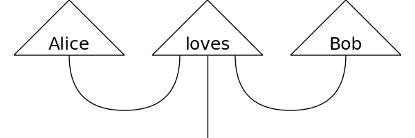

# Distributional Compositional Python

`discopy` computes natural language meaning in pictures.



## Recipe

1) Draw your picture.

```python
from discopy.disco import Pregroup, Word, Cup, Wire

s, n = Pregroup('s'), Pregroup('n')
Alice = Word('Alice', n)
loves = Word('loves', n.r @ s @ n.l)
Bob = Word('Bob', n)

grammar = Cup(n) @ Wire(s) @ Cup(n.l)
sentence = grammar << Alice @ loves @ Bob
```

2) Define a model.

```python
from discopy.disco import Model

ob = {s: 1, n: 2}
ar = {Alice: [1, 0], loves: [0, 1, 1, 0], Bob: [0, 1]}
F = Model(ob, ar)
```

3) Compute the meaning!

```python
assert F(sentence) == True
```

## Getting Started

Either a) install from pip:

```shell
pip install discopy
```

or b) install from sources:
```
git clone https://github.com/toumix/discopy.git
python discopy/setup.py install
```

## General Abstract Nonsense

`discopy` is a Python implementation of the categorical compositional distributional (DisCoCat) models, see [arXiv:1003.4394](https://arxiv.org/abs/1003.4394), [arXiv:1106.4058](https://arxiv.org/abs/1106.4058), [arXiv:1904.03478](https://arxiv.org/abs/1904.03478).

* `cat.Arrow` and `cat.Functor` implement free (dagger) categories and functors.
* `moncat.Diagram` and `moncat.MonoidalFunctor` implement free (dagger) monoidal categories and functors.
* `matrix.MatrixFunctor` implements matrix-valued (dagger) monoidal functors.
* `disco.Pregroup`, `disco.Cup` and `disco.Cap` implement free dagger pivotal and rigid monoidal categories.
* `disco.Word`, `disco.Grammar`, `disco.Parse` implement pregroup grammars.
* `disco.Model` implements rigid monoidal functors.
