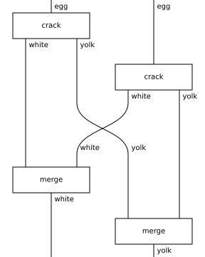
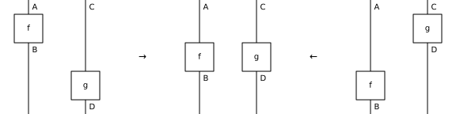
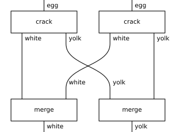
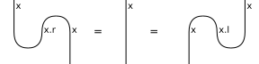
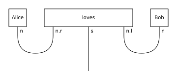
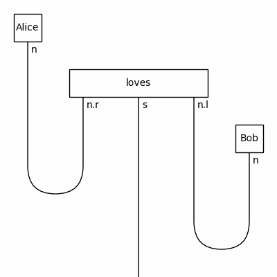
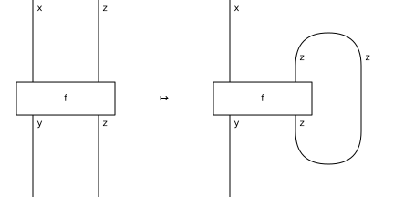
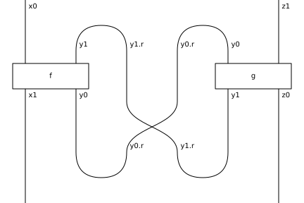

<picture>
  <source media="(prefers-color-scheme: dark)" srcset="https://github.com/discopy/discopy/raw/main/docs/_static/snake-equation-dark.svg">
  
</picture>

# DisCoPy

[](https://github.com/discopy/discopy/actions/workflows/build.yml)
[](https://docs.discopy.org/)
[](https://badge.fury.io/py/discopy)
[](https://doi.org/10.4204/EPTCS.333.13)

DisCoPy is a Python toolkit for computing with [string diagrams](https://en.wikipedia.org/wiki/String_diagram).

* **Organisation:** <https://discopy.org>
* **Documentation:** <https://docs.discopy.org>
* **Source code:** <https://github.com/discopy/discopy>
* **Paper (for applied category theorists):** <https://doi.org/10.4204/EPTCS.333.13>
* **Paper (for quantum computer scientists):** <https://arxiv.org/abs/2205.05190>

## Features

* abstract base classes for `Category`, `MonoidalCategory` and their subclasses as classified in Selinger's [Survey of graphical languages for monoidal categories (2009)](https://arxiv.org/abs/0908.3347)
* a `Diagram` data structure for string diagrams in any (pre)monoidal category with methods for diagram composition, drawing, rewriting and `Functor` evaluation into:
  - `Function`, i.e. wires as types and boxes as functions with either disjoint union (`python.additive`) or tuples (`python.multiplicative`)
  - `Tensor`, i.e. wires as dimensions and boxes as arrays from [NumPy](https://numpy.org), [PyTorch](https://pytorch.org/), [TensorFlow](https://www.tensorflow.org/), [TensorNetwork](https://github.com/google/TensorNetwork), [JAX](https://github.com/google/jax) and [Quimb](https://quimb.readthedocs.io/en/latest)
* an implementation of formal grammars ([context-free](https://en.wikipedia.org/wiki/Context-free_grammar), [categorial](https://en.wikipedia.org/wiki/Categorial_grammar), [pregroup](https://en.wikipedia.org/wiki/Pregroup_grammar) or [dependency](https://en.wikipedia.org/wiki/Dependency_grammar)) with interfaces to [lambeq](https://cqcl.github.io/lambeq), [spaCy](https://spacy.io/) and [NLTK](https://www.nltk.org/)
* an implementation of [categorical quantum mechanics](https://en.wikipedia.org/wiki/Categorical_quantum_mechanics) interfacing with:
  - [tket](https://github.com/CQCL/tket) for circuit compilation
  - [PyZX](https://github.com/Quantomatic/pyzx) for optimisation with the [ZX calculus](https://zxcalculus.com/)
* a `Drawing` data structure for labeled graphs embedded in the plane
* a `Term` data structure for lambda terms in the internal language of (bi)closed monoidal categories and their translation back and forth to diagrams
* a `Hypergraph` data structure for string diagrams in hypergraph categories and its restrictions to symmetric, traced, compact and Markov categories
* a combinantorial map data structure for string diagrams in compact categories and its restrictions to symmetric, (bi)closed and traced categories. The orientation on boxes can also help to enforce planarity.
* a `Stream` data structure, an implementation of [monoidal streams](https://arxiv.org/abs/2212.14494) as a [category with delayed feedback](https://doi.org/10.1051/ita:2002009)
* the `Int`-construction, also called the [geometry of interaction](https://ncatlab.org/nlab/show/Geometry+of+Interaction), i.e. the free tortile/compact closed category on a balanced/symmetric traced category

## Quickstart

```shell
pip install discopy
```

If you want to see DisCoPy in action, you can check out the following notebooks:

- [What is a diagram?](https://docs.discopy.org/en/main/notebooks/diagrams.html)
- [QNLP Tutorial](https://docs.discopy.org/en/main/notebooks/qnlp.html)
- [Geometry of Chatbot Interaction](docs/notebooks/chatbot-interaction.md)

Or you can keep scrolling down, skip the theory and go straight to the examples on [cooking](#example-cooking), [natural language](#example-alice-loves-bob) and [a geometry of chatbot interaction](#a-geometry-of-chatbot-interaction).

## Theory: categories, diagrams and gotchas

- [`discopy.abc`](discopy/abc.py) describes the hierarchy of monoidal categories with extra structures
- each abstract base class is implemented by a concrete module e.g. [`discopy.monoidal`](discopy/monoidal.py) implements the class `Diagram` of morphisms in the free `MonoidalCategory` generated by:
  1) `Ob` as generating objects and `Ty` as the free monoid over `Ob` with `@` as product and `Ty()` as unit
  2) `Box` as generating morphisms each with a list of objects `dom: Ty` and `cod: Ty` as input and output.
- a `Layer(left, box, right, *more)` is a tensor product of an alternating sequence of `Ty` and `Box` with whiskering `X @ f` and `f @ X` by concatenating a layer `f` with a type `X` on its left and right
- a `Diagram(inside, dom, cod)` is a sequence of composable layers `inside` with a designated input `dom` and output `cod`: the identity diagram is the empty sequence with `dom == cod`, composition `f >> g` is sequence concatenation
- the tensor of diagrams is decomposed in terms of composition and whiskering i.e. `f @ g = f @ g.dom >> f.cod @ g`, this is biased in the sense that `f` happens before `g` so that diagrams really live in a [premonoidal category](https://en.wikipedia.org/wiki/Premonoidal_category)
- *the first gotcha of DisCoPy:* `Box` is a subclass of `Diagram` with a cyclic reference `list(box.inside) == [Layer(Ty(), box, Ty())]`
- every categorical structure is implemented with the factory method pattern so that e.g. the method `Diagram.swap` computes the symmetry of arbitrary types with `Diagram.swap_factory = Swap` as subroutine for generating subclasses of `Box` for the symmetry of atomic types
- *the second gotcha of DisCoPy:* each `C: Category` comes with a class attribute `ar` such that `C.ar = C`; this happens with the decorator `@factory` and it allows for e.g. the subclass `Box` to know that it lives inside a bigger `Diagram` category

## Example: Cooking

This example is inspired from Pawel Sobocinski's blog post [Crema di Mascarpone and Diagrammatic Reasoning](https://graphicallinearalgebra.net/2015/05/06/crema-di-mascarpone-rules-of-the-game-part-2-and-diagrammatic-reasoning/).

```python
from discopy.utils import factory
from discopy.symmetric import Ty, Box, Diagram, Swap

@factory
class Ingredient(Ty):
  "The objects of the category of recipe diagrams."

@factory
class Recipe(Diagram):
  ob = Ingredient

class CookingStep(Box, Recipe):
  "A cooking step is a box in a recipe diagram."

class CookingSwap(Swap, CookingStep):
  "A cooking swap takes two ingredients `X @ Y` and gives `Y @ X`."

Recipe.braid_factory = CookingSwap  # Recipes need to know how to swap.

egg, white, yolk = Ingredient("egg"), Ingredient("white"), Ingredient("yolk")
crack = CookingStep("crack", egg, white @ yolk)
merge = lambda X: CookingStep("merge", X @ X, X)

# DisCoPy allows string diagrams to be defined as Python functions

@Recipe.from_callable(egg @ egg, white @ yolk)
def crack_two_eggs(x, y):
    (a, b), (c, d) = crack(x), crack(y)
    return (merge(white)(a, c), merge(yolk)(b, d))

# ... or in point-free style using parallel (@) and sequential (>>) composition

assert crack_two_eggs == (crack @ crack
  >> white @ CookingSwap(yolk, white) @ yolk
  >> merge(white) @ merge(yolk)).foliation()

crack_two_eggs.draw(path="docs/_static/readme/crack-eggs.svg")
```



By default, DisCoPy diagrams are made of layers with exactly one box in between some (possibly empty) list of wires on its left- and right-hand side.
We can get more general diagrams by specifying the list of layers `inside` manually:

```python
from discopy.monoidal import Layer, Equation

A, B, C, D = Ty(*"ABCD")
f, g = Box("f", A, B), Box("g", C, D)

left, right = f @ g.dom >> f.cod @ g, f.dom @ g >> f @ g.cod
middle = Diagram(inside=(Layer(Ty(), f, Ty(), g, Ty()), ), dom=A @ C, cod=B @ D)

Equation(Equation(
  left, middle, symbol="$\\rightarrow$"), right, symbol="$\\leftarrow$").draw()
```



or by calling the method `Diagram.foliation` which will minimize the length of the diagram:

```python

crack_two_eggs_at_once = crack_two_eggs.foliation()

empty = Ingredient()

assert crack_two_eggs_at_once == Recipe(
  dom=egg @ egg, cod=white @ yolk, inside=(
    Layer(empty, crack, empty, crack, empty),
    Layer(white, CookingSwap(yolk, white), yolk),
    Layer(empty, merge(white), empty, merge(yolk), empty)))

crack_two_eggs_at_once.draw(
  path="docs/_static/readme/crack-two-eggs-at-once.svg")
```



## Theory: functors, terms, maps and hypergraphs

`Functor` is the main algorithm of DisCoPy, there is one for each module X in the hierarchy for the class of functors with domain given by the free X-category defined there.
Functors can have arbitrary categories as codomain, by default they are endofunctors on the free X-category i.e. they send diagrams to diagrams by opening up boxes.
When the codomain is a concrete category, functors can perform arbitrary computation e.g. `discopy.matrix`, `discopy.python` and `discopy.drawing` define instances of the `MonoidalCategory` abstract base class, i.e. even the diagram layout algorithm itself is a functor.

However in most applications outside of diagram layout, computing a `for` loop over a list of layers with every swap explicit is not the most elegant way to evaluate a diagram.
DisCoPy has a number of alternative data structures that can encode different layers of the hierarchy in a faithful way:

- `Term` is a simply-typed lambda term in the internal language of monoidal closed categories, it can represent any diagram with a single output wire
- `CMap` is a combinatorial map encodes diagrams in any compact closed category as a permutation on the ports of each of its boxes
- `Hypergraph` encodes any diagram in a hypergraph category, i.e. with spiders (a.k.a. special commutative Frobenius algebras)

These come with methods for converting back and forth to diagrams which allow to e.g. simplify diagrams by removing redundant swaps and to check equality of diagrams up to the axioms of (symmetric, traced, compact, etc.) monoidal categories.
They can also come with methods for evaluating them directly in a concrete category, e.g. a `CMap` with a `Tensor` on each node can be compiled directly to an Einstein notation without translating it to a list of layers.

Note that while `Functor` implements only functors with free categories as domain, DisCoPy also implements instances of 2-functors i.e. with categories of categories as domain.
For instance, the `Int`-construction takes traced categories to compact categories and `Stream` takes monoidal categories to feedback categories, see [](#geom)

## Example: Alice loves Bob

### Snakes & Sentences

Wires can be bent using two special kinds of boxes: **cups** and **caps**, which satisfy the [snake equations](https://ncatlab.org/nlab/show/triangle+identities).

```python
from discopy.rigid import Ty, Id, Cup, Cap, Equation

x = Ty('x')
left_snake = x @ Cap(x.r, x) >> Cup(x, x.r) @ x
right_snake =  Cap(x, x.l) @ x >> x @ Cup(x.l, x)
assert left_snake.normal_form() == Id(x) == right_snake.normal_form()

Equation(left_snake, Id(x), right_snake).draw(
  path="docs/_static/readme/typed-snake-equation.svg")
```



In particular, DisCoPy can draw the grammatical structure of natural language sentences encoded as reductions in a [pregroup grammar](https://ncatlab.org/nlab/show/pregroup+grammar).
See Lambek, [From Word To Sentence (2008)](http://www.math.mcgill.ca/barr/lambek/pdffiles/2008lambek.pdf) for an introduction.

```python
from discopy.grammar.pregroup import Ty, Word, Cup

s, n = Ty('s'), Ty('n')  # sentence and noun
Alice, Bob = Word('Alice', n), Word('Bob', n)
loves = Word('loves', n.r @ s @ n.l)

sentence = Alice @ loves @ Bob >> Cup(n, n.r) @ s @ Cup(n.l, n)
sentence.foliation().draw(path="docs/_static/readme/alice-loves-bob.svg")
```



Many other grammatical frameworks can be encoded as diagrams, e.g. [`cfg`](https://docs.discopy.org/en/main/_api/discopy.grammar.cfg.html) (context-free), [`categorial`](https://docs.discopy.org/en/main/_api/discopy.grammar.categorial.html) and [`dependency`](https://docs.discopy.org/en/main/_api/discopy.grammar.dependency.html) grammars.

### Functors & Rewrites

**Monoidal functors** compute the meaning of a diagram, given an interpretation for each wire and for each box.
In particular, **tensor-valued functors** evaluate a diagram as a tensor network using [numpy](https://numpy.org/), [PyTorch](https://pytorch.org/), [TensorFlow](https://www.tensorflow.org/), [TensorNetwork](https://github.com/google/TensorNetwork) or [JAX](https://github.com/google/jax).

Applied to pregroup diagrams, DisCoPy implements the
**categorical compositional distributional** (_DisCoCat_) models of
[Clark, Coecke, Sadrzadeh (2008)](http://citeseerx.ist.psu.edu/viewdoc/download?doi=10.1.1.363.8703&rep=rep1&type=pdf).

```python
from discopy.grammar import pregroup
from discopy.tensor import Dim, Tensor

F = pregroup.Functor(
    ob_map={s: 1, n: 2},
    ar_map={Alice: [1, 0], loves: [[0, 1], [1, 0]], Bob: [0, 1]},
    cod=Tensor)

assert F(sentence)
```

**Diagram-valued functors** can fill each box with a complex diagram.
The result can then be simplified using `diagram.normalize()` to remove the snakes, this is called [autonomisation](https://arxiv.org/abs/1411.3827).

```python
from discopy.grammar.pregroup import Cap, Box

def wiring(word):
    if word.cod == n:  # word is a noun
        return word
    if word.cod == n.r @ s @ n.l:  # word is a transitive verb
        box = Box(word.name, n @ n, s)
        return Cap(n.r, n) @ Cap(n, n.l) >> n.r @ box @ n.l

W = pregroup.Functor(ob_map={s: s, n: n}, ar_map=wiring)

rewrite_steps = W(sentence).normalize()
sentence.to_gif(
  *rewrite_steps, path="docs/_static/readme/autonomisation.gif",
  timestep=1000, figsize=(4, 4))
```



## A geometry of chatbot interaction


The [`Int`](https://docs.discopy.org/en/main/_api/discopy.interaction.Int.html)-construction of [Joyal, Street & Verity (1996)](https://doi.org/10.1017/S0305004100074338) is

> a glorification of the construction of the integers from the natural numbers

i.e. the same we can pretend that a commutative monoid is a group so long as it is cancellative (i.e. `a + x == b + x` implies `a == b`) we can pretend that a monoidal category has cups and caps so long as it is traced, i.e. it has feedback loops:



Concretely, we get a compact category where the objects are given by pairs of objects in the traced category, morphisms are bidirectional processes with a positive and a negative direction.
Composition given by symmetric feedback, i.e. tracing out the common boundary of the two processes so they can communicate along an infinity-shaped pair of wires between them:



We can use this geometry of interaction to interpret words as processes rather than states:

```python
from discopy.interaction import Ty, Int
from discopy.compact import Ty as T, Diagram as D, Box, Equation

N, S = T('N'), T('S')
A, B = Box('A', N, N), Box('B', N, N)
L = Box('L', N @ S @ N, N @ S @ N)
swaps = D.permutation((2, 1, 0), N @ S @ N)
G = pregroup.Functor(
    ob_map={s: Ty[T](S, S), n: Ty[T](N, N)},
    ar_map={Alice: A, loves: swaps >> L, Bob: B},
    cod=Int(D))

ALB_trace = (A @ S @ B >> L).trace(left=True).trace(left=False).foliation()

assert Equation(G(sentence).inside, ALB_trace)

Equation(sentence.foliation(), ALB_trace, symbol="$\\mapsto$").draw()
```


### Streams and delayed feedback

A key axiom of traced monoidal categories which allows to simplify diagrams is the **yanking equation**:


If we relax this assumption we get the concept of a [`feedback`](https://docs.discopy.org/en/main/_api/discopy.feedback.html) category where the objects come with a [`delay`](https://docs.discopy.org/en/main/_api/discopy.feedback.Ob.html#discopy.feedback.Ob.delay) operation and the feedback loops have a more restricted shape:


Given a symmetric category, we can construct a feedback category of **monoidal streams** where the feedback operation is given by adding an internal state. We can use this to unroll our diagram of the previous section:

```python
from discopy.stream import Ty, Stream

N, S = Ty("N"), Ty("S")
A, B = [Stream.sequence(f, N, N) for f in "AB"]
L = Stream.sequence('L', S.head @ N.delay() @ N.delay(), N @ N)
ALB = (L >> A @ B).feedback(dom=S.head, cod=Ty(), mem=N @ N)
ALB.unroll(2).now.foliation().draw()
```


## References

If you use DisCoPy in the context of an academic publication, we suggest you cite:

* G. de Felice, A. Toumi & B. Coecke, _DisCoPy: Monoidal Categories in Python_, EPTCS 333, 2021, pp. 183-197, [DOI: 10.4204/EPTCS.333.13](https://doi.org/10.4204/EPTCS.333.13)

If furthermore your work is related to quantum computing, you can also cite:

* A. Toumi, G. de Felice & R. Yeung, _DisCoPy for the quantum computer scientist_, [arXiv:2205.05190](https://arxiv.org/abs/2205.05190)

If you use any of the recent features (e.g. `Hypergraph`) you could also mention:

* A. Toumi, R. Yeung, B. Poór & G. de Felice, _DisCoPy: the Hierarchy of Graphical Languages in Python_ [arXiv:2311.10608](https://arxiv.org/abs/2311.10608)

## Contribute

We're keen to welcome new contributors!

First, read the [contributing guidelines](https://github.com/discopy/discopy/blob/main/CONTRIBUTING.md) then [open an issue](https://github.com/discopy/discopy/issues/new).
