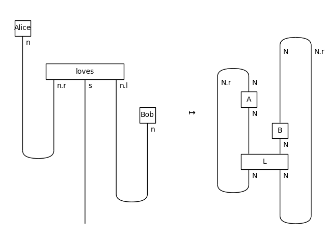
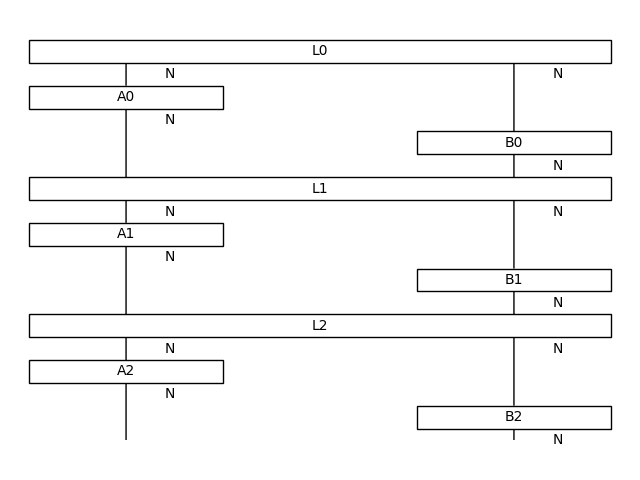

<picture>
  <source media="(prefers-color-scheme: dark)" srcset="https://github.com/discopy/discopy/raw/main/docs/_static/snake-equation-dark.svg">
  
</picture>

# DisCoPy

[](https://github.com/discopy/discopy/actions/workflows/build.yml)
[](https://docs.discopy.org/)
[](https://badge.fury.io/py/discopy)
[](https://doi.org/10.4204/EPTCS.333.13)

DisCoPy is a Python toolkit for computing with [string diagrams](https://en.wikipedia.org/wiki/String_diagram).

* **Organisation:** <https://discopy.org>
* **Documentation:** <https://docs.discopy.org>
* **Source code:** <https://github.com/discopy/discopy>
* **Paper (for applied category theorists):** <https://doi.org/10.4204/EPTCS.333.13>
* **Paper (for quantum computer scientists):** <https://arxiv.org/abs/2205.05190>

DisCoPy began as an implementation of [DisCoCat](https://en.wikipedia.org/wiki/DisCoCat) and [QNLP](https://en.wikipedia.org/wiki/Quantum_natural_language_processing). This has now become its own library: [lambeq](https://cqcl.github.io/lambeq).

## Features

* a [`Diagram`](https://docs.discopy.org/en/main/_api/discopy.monoidal.Diagram.html) data structure for planar string diagrams in any ([pre](https://ncatlab.org/nlab/show/premonoidal+category))[monoidal category](https://en.wikipedia.org/wiki/Monoidal_category) in the [hierarchy of graphical languages](https://en.wikipedia.org/wiki/String_diagram#Hierarchy_of_graphical_languages) (with braids, twists, spiders, etc.) with methods for diagram composition, drawing, rewriting and [`Functor`](https://docs.discopy.org/en/main/_api/discopy.monoidal.Functor.html) evaluation into:
  - Python code, i.e. wires as types and boxes as functions
  - [tensor networks](https://en.wikipedia.org/wiki/Tensor_network), i.e. wires as dimensions and boxes as arrays from [NumPy](https://numpy.org), [PyTorch](https://pytorch.org/), [TensorFlow](https://www.tensorflow.org/), [TensorNetwork](https://github.com/google/TensorNetwork) and [JAX](https://github.com/google/jax)
* an implementation of formal grammars ([context-free](https://en.wikipedia.org/wiki/Context-free_grammar), [categorial](https://en.wikipedia.org/wiki/Categorial_grammar), [pregroup](https://en.wikipedia.org/wiki/Pregroup_grammar) or [dependency](https://en.wikipedia.org/wiki/Dependency_grammar)) with interfaces to [lambeq](https://cqcl.github.io/lambeq), [spaCy](https://spacy.io/) and [NLTK](https://www.nltk.org/)
* an implementation of [categorical quantum mechanics](https://en.wikipedia.org/wiki/Categorical_quantum_mechanics) interfacing with:
  - [tket](https://github.com/CQCL/tket) for circuit compilation
  - [PyZX](https://github.com/Quantomatic/pyzx) for optimisation with the [ZX calculus](https://zxcalculus.com/)
  - [PennyLane](https://pennylane.ai/) for automatic differentiation
* a [`Hypergraph`](https://docs.discopy.org/en/main/_api/discopy.hypergraph.Hypergraph.html) data structure for string diagrams in hypergraph categories and its restrictions to symmetric, traced, compact and Markov categories
* a [`Stream`](https://docs.discopy.org/en/main/_api/discopy.stream.Stream.html) data structure, an implementation of [monoidal streams](https://arxiv.org/abs/2212.14494) as a [category with delayed feedback](https://doi.org/10.1051/ita:2002009)
* the [`Int`](https://docs.discopy.org/en/main/_api/discopy.interaction.Int.html)-construction, i.e. the free tortile category on a balanced traced category, also called the [geometry of interaction](https://ncatlab.org/nlab/show/Geometry+of+Interaction)

## Quickstart

```shell
pip install discopy
```

If you want to see DisCoPy in action, check out the examples:

- [Cooking](#example-cooking)
- [Alice loves Bob](#example-alice-loves-bob)
- [Geometry of Chatbot Interaction]()

## Contribute

We're keen to welcome new contributors!

First, read the [contributing guidelines](https://github.com/discopy/discopy/blob/main/CONTRIBUTING.md).
Then get in touch on [Discord](https://discopy.org/discord)
or [open an issue](https://github.com/discopy/discopy/issues/new).

## How to cite

If you used DisCoPy in the context of an academic publication, we suggest you cite:

* G. de Felice, A. Toumi & B. Coecke, _DisCoPy: Monoidal Categories in Python_, EPTCS 333, 2021, pp. 183-197, [DOI: 10.4204/EPTCS.333.13](https://doi.org/10.4204/EPTCS.333.13)

If furthermore your work is related to quantum computing, you can also cite:

* A. Toumi, G. de Felice & R. Yeung, _DisCoPy for the quantum computer scientist_, [arXiv:2205.05190](https://arxiv.org/abs/2205.05190)

If you use any of the recent features (e.g. `Hypergraph`) you should also mention:

* A. Toumi, R. Yeung, B. Poór & G. de Felice, _DisCoPy: the Hierarchy of Graphical Languages in Python_ [arXiv:2311.10608](https://arxiv.org/abs/2311.10608)

## Example: Cooking

This example is inspired from Pawel Sobocinski's blog post [Crema di Mascarpone and Diagrammatic Reasoning](https://graphicallinearalgebra.net/2015/05/06/crema-di-mascarpone-rules-of-the-game-part-2-and-diagrammatic-reasoning/).

```python
from discopy.symmetric import Ty, Box, Diagram

egg, white, yolk = Ty("egg"), Ty("white"), Ty("yolk")
crack = Box("crack", egg, white @ yolk)
merge = lambda x: Box("merge", x @ x, x)

# DisCoPy allows string diagrams to be defined as Python functions

@Diagram.from_callable(egg @ egg, white @ yolk)
def crack_two_eggs(left_egg, right_egg):
    left_white, left_yolk = crack(left_egg)
    right_white, right_yolk = crack(right_egg)
    return (merge(white)(left_white, right_white),
            merge(yolk)(left_yolk, right_yolk))

# ... or in point-free style using parallel (@) and sequential (>>) composition

assert crack_two_eggs == crack @ crack\
  >> white @ Diagram.swap(yolk, white) @ yolk\
  >> merge(white) @ merge(yolk)

crack_two_eggs.draw()
```


## Example: Alice loves Bob

### Snakes & Sentences

Wires can be bended using two special kinds of boxes: **cups** and **caps**, which satisfy the [snake equations](https://ncatlab.org/nlab/show/triangle+identities).

```python
from discopy import Cup, Cap

x = Ty('x')
left_snake = Id(x) @ Cap(x.r, x) >> Cup(x, x.r) @ Id(x)
right_snake =  Cap(x, x.l) @ Id(x) >> Id(x) @ Cup(x.l, x)
assert left_snake.normal_form() == Id(x) == right_snake.normal_form()
```


In particular, DisCoPy can draw the grammatical structure of natural language sentences encoded as reductions in a [pregroup grammar](https://ncatlab.org/nlab/show/pregroup+grammar) (see Lambek, [From Word To Sentence (2008)](http://www.math.mcgill.ca/barr/lambek/pdffiles/2008lambek.pdf) for an  introduction).

```python
from discopy.grammar.pregroup import Ty, Word, Cup

s, n = Ty('s'), Ty('n')
Alice, Bob = Word('Alice', n), Word('Bob', n)
loves = Word('loves', n.r @ s @ n.l)

sentence = Alice @ loves @ Bob\
    >> Cup(n, n.r) @ s @ Cup(n.l, n)
```


Many other grammatical frameworks can be encoded as diagrams, e.g. [`cfg`](https://docs.discopy.org/en/main/_api/discopy.grammar.cfg.html) (context-free), [`categorial`](https://docs.discopy.org/en/main/_api/discopy.grammar.categorial.html) and [`dependency`](https://docs.discopy.org/en/main/_api/discopy.grammar.dependency.html) grammars.

### Functors & Rewrites

**Monoidal functors** compute the meaning of a diagram, given an interpretation for each wire and for each box.
In particular, **tensor functors** evaluate a diagram as a tensor network using [numpy](https://numpy.org/), [PyTorch](https://pytorch.org/), [TensorFlow](https://www.tensorflow.org/), [TensorNetwork](https://github.com/google/TensorNetwork) or [JAX](https://github.com/google/jax).
Applied to pregroup diagrams, DisCoPy implements the
**categorical compositional distributional** (_DisCoCat_) models of
[Clark, Coecke, Sadrzadeh (2008)](http://citeseerx.ist.psu.edu/viewdoc/download?doi=10.1.1.363.8703&rep=rep1&type=pdf).

```python
from discopy.cat import Category
from discopy.grammar import pregroup
from discopy.tensor import Dim, Tensor

F = pregroup.Functor(
    ob={s: 1, n: 2},
    ar={Alice: [1, 0], loves: [[0, 1], [1, 0]], Bob: [0, 1]},
    cod=Category(Dim, Tensor))

assert F(sentence)
```

**Free functors** (i.e. from diagrams to diagrams) can fill each box with a complex diagram.
The result can then be simplified using `diagram.normalize()` to remove the snakes, this is called [autonomisation](https://arxiv.org/abs/1411.3827).

```python
from discopy.grammar.pregroup import Cap, Box

def wiring(word):
    if word.cod == n:  # word is a noun
        return word
    if word.cod == n.r @ s @ n.l:  # word is a transitive verb
        box = Box(word.name, n @ n, s)
        return Cap(n.r, n) @ Cap(n, n.l) >> n.r @ box @ n.l

W = pregroup.Functor(ob={s: s, n: n}, ar=wiring)

rewrite_steps = W(sentence).normalize()
sentence.to_gif(*rewrite_steps, path='autonomisation.gif', timestep=1000)
```


## Geometry of Chatbot Interaction

### From states to processes

The [`Int`](https://docs.discopy.org/en/main/_api/discopy.interaction.Int.html)-construction of [Joyal, Street & Verity (1996)](https://doi.org/10.1017/S0305004100074338) is

> a glorification of the construction of the integers from the natural numbers

i.e. the same way we can freely add inverses to a commutative monoid to get a group, e.g. $\mathbb{N} \hookrightarrow Int(\mathbb{N}) = \mathbb{Z}$ where

$$Int(M) \ = \ (M \times M) \ / \ \big\{ (x, x') \sim (y, y') \ \vert \ x + y' = x' + y \big\}$$

you can freely add cups and caps to a [`symmetric`](https://docs.discopy.org/en/main/_api/discopy.symmetric.html) or [`balanced`](https://docs.discopy.org/en/main/_api/discopy.balanced.html) category to get a [`compact`](https://docs.discopy.org/en/main/_api/discopy.compact.html) or [`tortile`](https://docs.discopy.org/en/main/_api/discopy.tortile.html) category.

The only condition is that the monoid needs to be **cancellative**, i.e. $x + n = y + n \implies x = y$.
The [vertical categorification](https://ncatlab.org/nlab/show/vertical+categorification) of a cancellative monoid is called a [`traced`](https://docs.discopy.org/en/main/_api/discopy.traced.html) category, where the diagrams can have feedback loops:


Given a traced category $C$, we construct $Int(C)$ with objects given by $Ob(Int(C)) = Ob(C) \times Ob(C)$, arrows given by $Int(C)((x, x'), (y, y')) = C(x \otimes y', x' \otimes y)$ and the composition is given by **symmetric feedback**:


The structure theorem of Joyal-Street-Verity says that the embedding $C \hookrightarrow Int(C)$ is fully-faithful, i.e. we can remove all the snakes and replace all the cups and caps with feedback loops.
We can use this geometry of interaction to interpret words as processes rather than states:

```python
from discopy.interaction import Ty, Int
from discopy.drawing import Equation
from discopy.grammar.pregroup import Word, Cup, Diagram, Functor
from discopy.compact import Ty as T, Diagram as D, Box, Category, Swap

N = T("N")
A, L, B = Box('A', N, N), Box('L', N @ N, N @ N), Box('B', N, N)
G = pregroup.Functor(
    ob={s: Ty[T](), n: Ty[T](N, N)},
    ar={Alice: A, loves: Swap(N, N) >> L, Bob: B},
    cod=Int(Category(T, D)))

with D.hypergraph_equality:
  assert G(sentence).inside == (A @ B >> L).trace(left=True).trace(left=False)
```



### Streams and delayed feedback

A key axiom of traced monoidal categories which allows to simplify diagrams is the **yanking equation**:


If we relax this assumption we get the concept of a [`feedback`](https://docs.discopy.org/en/main/_api/discopy.feedback.html) category where the objects come with a [`delay`](https://docs.discopy.org/en/main/_api/discopy.feedback.Ob.html#discopy.feedback.Ob.delay) operation and the feedback loops have a more restricted shape:


Given a symmetric category $C$, we can construct a feedback category of **monoidal streams** $Stream(C)$ where the objects are infinite sequences of objects $Ob(Stream(C)) = C \times Ob(Stream(C))$, and the arrows are infinite sequences of arrows $Stream(C)(X, Y) = \coprod_{M} Stream(C)(X, Y, M)$ defined by
$$Stream(C)(X, Y, M) = C(X_0 \otimes M_0, Y_0 \otimes M_1)  \times Stream(C)(X^+, Y^+, M^+)$$
where $X_0$ and $X^+$ are the head and the tail of the stream $X$.
This comes with a delay $d(X) \in Ob(Stream(C))$ given by the monoidal unit $d(X)_0 = I$, $d(X)^+ = X$ and feedback operation given by:

```python
from discopy import symmetric
from discopy.stream import Ty, Stream

x, y, m = [Ty.sequence(symmetric.Ty(n)) for n in "xym"]
f = Stream.sequence("f", x @ m.delay(), y @ m)
fb = f.feedback(x, y, m)
Equation(f.unroll(2).now, fb.unroll(2).now, symbol="$\\mapsto$").draw()
```


We can use this to unroll our diagram of the previous section:

```python
N = Ty("N")
A, B = [Stream.sequence(f, N, N) for f in "AB"]
L = Stream.sequence('L', N.delay() @ N.delay(), N @ N)
ALB = (L >> A @ B).feedback(dom=Ty(), cod=Ty(), mem=N @ N)
ALB.unroll(2).now.draw(path="alice-loves-unrolling.png")
```




> The play is set in a basement with computers everywhere, Alice and Bob are dressed like hackers with black hoodies and nerdy glasses, they have somewhat of a hipster vibe.
> 
> Alice: I think I’ve cracked the encryption, but it’s like nothing I’ve seen before. DisCoPy — it’s almost...alive.  
> 
> Bob: What do you mean, alive? You’re not saying it’s AI, are you? Because if it is, we’re in way over our heads.
> 
> Alice: It’s not just AI, Bob. It’s adaptive, learning—like it knows we’re here.
> 
> (Bob takes a step back, his face serious as he considers the implications. He glances at the screens around them, suddenly aware of their presence.)
> 
> Bob: If that’s true, we’re not just hacking into the system. We’re waking it up. And if it wakes up angry...
> 
> Alice: Then we’re the ones who let it loose.
> 
> Bob: We need to find the off switch. Now. Before it finds us.
> 
> SILENCE
