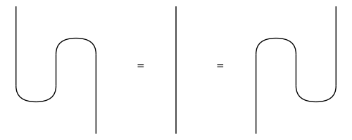

#####################
DisCoPy documentation
#####################

.. mdinclude:: what-is-discopy.md

.. toctree::
    :caption: Basics
    :hidden:

    notebooks/crema-di-mascarpone
    notebooks/lasagna-recursion
    notebooks/bell-test
    notebooks/pixels2diagram
    notebooks/diagramification

.. toctree::
    :caption: Advanced
    :hidden:

    notebooks/rewriting-diagrams
    notebooks/new-features-0.3.3
    notebooks/your-own-category
    notebooks/diag-diff
    notebooks/quantum-lunch-talk
    notebooks/discopy2pyzx
    notebooks/monoid-delooping

.. toctree::
    :caption: QNLP
    :hidden:

    notebooks/alice-loves-bob
    notebooks/bob-is-rich
    notebooks/qnlp-experiment
    notebooks/qnlp-tutorial
    notebooks/snake-removal
    notebooks/frobenius-anatomy
    notebooks/functorial-learning

.. toctree::
    :caption: Talks
    :hidden:

    talks/qnlp19
    talks/qnlp20
    talks/act20
    talks/pydata.berlin

.. toctree::
    :caption: API
    :maxdepth: 2
    :hidden:

    discopy/cat
    discopy/monoidal
    discopy/rigid
    discopy/biclosed
    discopy/hypergraph
    discopy/matrix
    discopy/tensor
    discopy/quantum
    discopy/grammar
    discopy/drawing
    discopy/utils

Indices and tables
==================

* :ref:`genindex`
* :ref:`modindex`
* :ref:`search`
