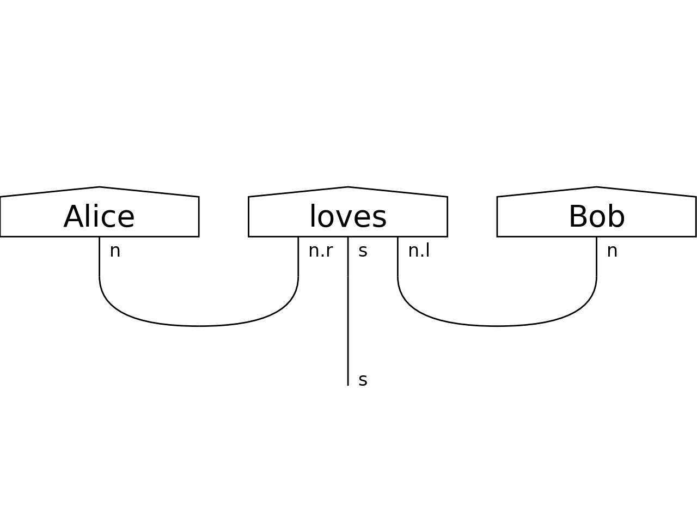

discopy
=======

`discopy` computes natural language meaning in pictures.

.. toctree::
   :maxdepth: 2
   :caption: Contents:

   cat/index.rst
   moncat/index.rst
   rigidcat/index.rst
   matrix/index.rst
   function/index.rst
   circuit/index.rst
   pregroup/index.rst

Indices and tables
------------------

* :ref:`genindex`
* :ref:`modindex`
* :ref:`search`
