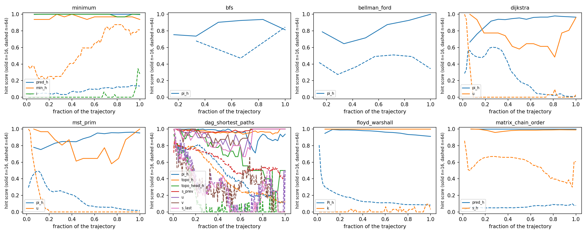

# CLRS-30: an algorithm as a diagram, an interpretation and a solver

Parts 1 and 2 of the project in [`project.md`](project.md): the harness, and
all **eight** algorithms under one protocol. Built with
[`discopy.neural`](../../../../discopy/neural/), on the samples of the CLRS-30
benchmark (Veličković et al. 2022), under its canonical protocol — train at
`n ≤ 16`, validate at `n = 16`, test out of distribution at `n = 64`.

Part 2 adds five algorithms, and with them the three things Part 1 could not
express: **edge-level decoders** (`floyd_warshall` and `matrix_chain_order`
answer about *pairs*), a **directed** edge (`dag_shortest_paths` is the one
directed task of the eight), and the **trajectory rule** — a run is as many
steps as the sampled execution took, rather than a constant 16 rounds. The
scientific payload is H1: the same diagram trained twice, once with a
recurrent state on every pair and once with none.

One thing in `discopy` changed, in Part 1: `"max"` joined `"mean"` and
`"sum"` in `discopy.neural.cells.POOL`, because the aggregator is the one
part of a message passer that a *change of size* can see and a
size-generalization study cannot be run without the choice. Part 2 needed
**nothing**: its one custom cell — an edge that can be directed and whose
state can be erased — is thirty lines in `model.py`, where a task's
artefacts belong. A performance fix was tried, measured and **reverted**;
[NOTES.md](NOTES.md) records what it was worth and why the answer was "not
enough to edit the library from inside a study".

## What a model is here

An algorithm's input is a graph, so the *diagram is drawn per batch* out of the
adjacency matrices of its members — which is the structural difference from
[`examples/sudoku`](../sudoku/), where one grid served every puzzle.

```python
model = MapNN(
    ob={MSG: Dim(16), STATE: Dim(96), FEAT: Dim(16),
        ESTATE: Dim(48), WEIGHT: Dim(16), GSTATE: Dim(96)},
    ar={"node": Site(...), "edge": Link(...), "readout": Site(...)},
    solver=Iterate(inject=False))          # the depth is the trajectory's
```

`ESTATE: Dim(0)` is the other arm of H1, and it erases the state ports from
the same diagram. A stock `Site` cannot be built without a state to carry —
it raises, correctly — so the edge is the study's own cell, `model.Link`,
which also holds the direction knob. [NOTES.md](NOTES.md) argues why that is
thirty lines in the example rather than eight in the library.

Three generators, drawn by `from_incidence`:

| box | is | ports |
|---|---|---|
| `node` | one per node | one `msg` per relation it belongs to, a traced `state`, a traced `feat` carrying its encoded inputs |
| `edge` | one per edge, or one per **pair** | two `msg`, a traced `estate`, a traced `weight` the cell emits unchanged (`Mode.CARRY`) |
| `readout` | one per **sample** | one `msg` per node of the sample, a traced `gstate` |

### Which graph, and why

Six of the eight draw the graph the sampler drew. Two do not, and the reason
is what they are *asked*: `floyd_warshall` outputs `Pi[i, j]` for **every**
pair and `matrix_chain_order` outputs `s[i, j]` for every interval, including
the pairs no edge joins. A model with one box per sampled edge has nowhere to
keep the answer for the others, so those two are drawn on the **complete
graph** — one box per pair — and the sampled graph enters as an input on the
edge (`adj`) rather than as the wiring. That is the diagram H1 asks its
question of: every pair is a box, so a pair can *remember*.

It is also cheaper than it sounds. The complete graph on 16 nodes is 120 edge
boxes against an Erdős–Rényi sample's ~30, but it is **one degree**, so a
round costs 3 batched calls against 13 — and a round is bound by its launches.
Measured, one epoch of 128 training trajectories: `floyd_warshall` 11.8 s at
3840 edge boxes, `bfs` 14.1 s at 1002. And since the wiring depends on the
size alone, two batches of a size are the *same* diagram: a whole split
compiles once (`model.dense_graph`), which is what makes 31 s of drawing a
one-off rather than a per-batch cost.

### Direction

`dag_shortest_paths` is the one directed task of the eight — `python
dataset.py --survey` reads that off the samplers, it is not a recollection.
Its edge box declares `Sym.NONE` on its two message ports: the cell answers
its source and its target with different arithmetic, so **no equation is
owed** and `check_equivariant` returns the empty dictionary rather than a
zero. Which endpoint is the source is a bit on the carried input, since
`from_incidence` assigns the lower-indexed endpoint the first slot and a pair
is one box either way.

**`Sym.NONE` is claimed by that one task and by nothing else.** The other six
edge cells — `bfs`, `bellman_ford`, `dijkstra`, `mst_prim`,
`floyd_warshall`, `matrix_chain_order`; `minimum` draws no edges at all — are
`Sym.PERM`, they pool their two legs, and they owe the equation an orbit
owes. The signature is a function of the sampler and of nothing else
(`edge(algorithm in DIRECTED)`, one call site in `model.build`), so
convenience cannot quietly widen it: `Link` is not "the directed cell used
everywhere", it is a cell that takes whichever signature the task has. All
seven cells that exist are in the set `evaluate.equivariance` measures —
`node`, `edge` and `readout` for every algorithm, in float64, on every seed
of every report — and
`test_an_edge_is_an_orbit_wherever_the_sampler_is_undirected` asserts the
signature *and* the measurement for all eight tasks, so H4 has six edge
residuals, two node/readout residuals per task, and one honest hole where the
directed cell is.

The readout relation earns its place three times over: it is where graph-level
features live, it is the *only* path between the nodes of `minimum` — which has
no edges at all — and it gives every node a degree, so an isolated node of an
Erdős–Rényi sample still reaches `from_incidence`.

A batch is one diagram: several samples laid side by side in one incidence list
*is* their monoidal product, so nothing is padded and a batch of 32 graphs costs
one compilation, reused for the whole run.

### Two clocks, and one function that aligns them

A node reaches a node *through a box* — `node → edge → node` and
`node → readout → node` are both two rounds — so one step of the imitated
algorithm is `HOPS = 2` rounds. That is the sudoku study's hop law
(`A@2R ≈ B@R`) reappearing on a benchmark where the depth means something: the
ground-truth trajectory says how many steps the algorithm took.

The correspondence is **one named function**, `model.alignment`, and both
`Model.checkpoints` and `Model.hint_targets` read it rather than repeating it:

| checkpoint `k` | is read after round | is supervised on |
|---|---|---|
| 0 | `HOPS · 1` | `hints[1]` |
| `k` | `HOPS · (k + 1)` | `hints[k + 1]` |

`hints[0]` is the trajectory's initial condition rather than something to
predict — this is `clrs._src.evaluation.evaluate_hints`' own indexing, which
scores hint prediction `i` against `idx = i + 1`. An off-by-one in either
column is the worst kind of defect: the model half-learns the shifted target
and every probe comes out uniformly mediocre, with nothing obviously broken.
So it is pinned twice, constructively:

* `test_a_checkpoint_is_the_algorithm_step_it_says_it_is` runs `bfs` on a
  **path graph**, where the `k`-hop ball is `{0, …, k}` by inspection, and
  asserts that the target of checkpoint `k` is that set for `k + 1` and that
  the checkpoint is the state after `HOPS · (k + 1)` rounds;
* `test_the_benchmarks_hints_are_the_hop_balls` asserts the same convention
  against the benchmark's own arrays, with the ball recomputed by repeated
  adjacency application.

The per-probe hint curves in the artefacts are the symptom-side net: a
misalignment shows as uniform mediocrity across *all* probes at once.

### Depth is the trajectory

**`rounds = HOPS × max(lengths in the batch)`, at train and at test.** Part 1
ran a constant 16 rounds for every sample of every algorithm — eight steps of
an algorithm whose trajectory is three steps long on one row of the table and
sixty-four on another. At `n = 64` a fixed 16 rounds covers an eighth of
`floyd_warshall`'s `k` loop, so "the traced edge state does not recover the
triplet gap" and "the run stopped at step 8 of 64" would not be
distinguishable — and H1 is the payload.

Three consequences worth stating:

* the test-time sweep becomes a **multiple** of the trained depth (`x1`,
  `x1.5`, `x3`), which is the only form of it that asks the same question at
  two sizes; every point stays a whole number of hops, so the checkpoints keep
  landing where `alignment` says;
* the `settled` clamp of `Model.loss` **never binds**: a sample that finishes
  early is supervised on its answer at every checkpoint after it, so "reach the
  answer and stay there" is trained rather than hoped for. That is what Part 1
  could not do for `minimum`, whose 1.00-at-16-rounds and 0.78-at-48 was
  under-supervision and not an aggregator effect;
* it costs. `dag_shortest_paths` is 98 rounds at `n = 16` and 374 at `n = 64`
  against Part 1's constant 16, because its hints advance one elementary
  depth-first operation at a time; [NOTES.md](NOTES.md) has the bill per
  algorithm.

Part 1's numbers are **not comparable across this change** and are labelled as
their own fixed-depth row; `config.FIXED` keeps that regime runnable and its
artefacts are in [`artifacts/part1-fixed-depth/`](artifacts/part1-fixed-depth/).

### The two ends of the task

CLRS hands a model *typed probes*: inputs, one hint per step of the execution,
and outputs. Each input probe gets its own linear encoder and they are summed
onto the node input loop (edge probes onto the edge weight loop), exactly as
CLRS encodes them; each decoded probe — every hint and every output — gets a
decoder **of its own**, whose *shape* its feature type fixes:

| type | decoder | loss | score |
|---|---|---|---|
| `node/scalar` | linear | MSE | MSE |
| `node/mask` | linear | BCE | F1 |
| `node/mask_one` | linear, softmax over nodes | cross-entropy | accuracy |
| `node/categorical` | linear to the classes, softmax | cross-entropy | accuracy |
| `node/pointer` | bilinear over node-state pairs, softmax per row | cross-entropy | accuracy |
| `edge/scalar` | `w₁h_i + w₂h_j + w_e e_ij` | MSE | MSE |
| `edge/mask` | the same, as a logit | BCE | F1 |
| `edge/pointer` | the pair against every candidate node, combined by a max | cross-entropy | accuracy |
| `graph/mask` | linear off the readout relation's state | BCE | F1 |

The three edge rows are `clrs._src.decoders._decode_edge_fts`' own shapes,
and their last term is the whole of H1: **erase the edge state and the head
still answers**, from an ordered pair of node states and nothing else. That
the edge term is the only difference between the two arms is what makes their
comparison one axis. The `graph/mask` row is what the stateful readout
relation was kept for — a graph-level probe is a property of the *execution*,
so it needs somewhere to accumulate, which a stateless `Relation` would not
have.

One head per probe rather than one per type, because two probes of a type are
two different questions asked of the same state: `minimum` decodes `min`,
`min_h` and `i` as three `node/mask_one` probes — the answer, the running
answer and the loop counter — and sharing a head between them asks one logit
per node to be three distributions at once. It is what CLRS does, and
[NOTES.md](NOTES.md) records what it cost to find out the hard way.

The scores are `clrs._src.evaluation`'s verbatim, and their mean over the output
probes is what the papers report as micro-F1. Hints supervise; hints are not
scored.

### How a site pools

Every site reduces its message orbit with one key of
`discopy.neural.cells.POOL`, and it is the one architectural knob a *change of
size* can see. A mean and a sum both rescale when a node's degree grows from
`n = 16` to `n = 64`; a max keeps an extremum, and an extremum is what `minimum`
is made of and what the relaxation step of `bellman_ford` is made of. So it is a
budget field rather than a literal, `--pool max` selects it, and a budget files
its artifacts under a tag of its own so the two campaigns sit side by side
instead of overwriting each other.

## Running it

```shell
# once, in an environment with the benchmark's sampler (`pip install dm-clrs`)
python dataset.py --generate

# anywhere with numpy: re-decide the cached outputs against the reference
python dataset.py --check

# with the sampler: what all eight of project.md's algorithms actually draw
python dataset.py --survey

python train.py --quick                     # a few-second miniature
python train.py --algorithms bfs --seeds 0  # one row of the table
python train.py --pool max --seeds 0        # the same, aggregating with max
python train.py --algorithms floyd_warshall --node-only   # H1's other arm
python train.py --rounds 16                 # Part 1's fixed-depth regime
python evaluate.py --seeds 0                # scores, sweep, residuals, hints
python evaluate.py --h1 --algorithms floyd_warshall   # the two arms, as a table
python figures.py                           # the hint and residual curves
```

Generation and training deliberately need different environments — the sampler
brings jax, haiku and tensorflow, the model brings torch — so the `npz` cache is
the interface between them. The probe *spec* is copied into `dataset.py` rather
than imported, and `dataset.check_spec` asserts the copy against `clrs` on every
generation.

`dataset.check` re-decides every cached output with a transcription of the
reference algorithm — all eight, tie-breaking included, because a shortest-path
*tree* is not determined by its distances — and asserts that `adj` is symmetric
exactly when its sampler is undirected, has a full diagonal, and is the graph of
`A`. That is what makes the cache trustworthy without `clrs` in scope, and it is
how the brief's expectation that `bellman_ford` needs symmetrising was found to
be wrong: CLRS's own sampler draws it `directed=False`.

## Results

`FULL` is 300 epochs of 32 batches — 9600 optimizer steps, near enough the
10 000 the CLRS-30 baselines take — at lr 1e-3, AdamW, grad-norm clip 1.0,
on one H100, under the trajectory rule. Every number is written by
`evaluate.py` into `artifacts/<tag>-<algorithm>-report.json` beside its
provenance.

**Which rows get seeds, and what `±` means.** Every row of the eight-task
table and both arms of H1 are **three seeds** (`config.SEEDS`, the protocol's
own number) — that is 8 × 3 primary runs plus 2 × 3 node-only ones, and the
budget was spent before the table was written rather than retrofitted onto
the rows that looked worth rerunning. The aggregator ablation below is
single-seed and says so in its own row; it is a diagnostic, not a table row.

The two spreads are different questions and the table gives them different
columns:

* **`± s.e.m.`** — the standard error over the three seeds. This is the
  anchors' own convention: Ibarz et al. state that their "error bars
  represent standard error of the mean across seeds (3 seeds for previous
  SOTA experiments, 10 seeds for current)", so the floor's interval is over
  three seeds and the ceiling's over ten. It answers *would another
  initialization have given this*.
* **`± 95 % CI`** — 1.96 standard errors over the 128 trajectories *within* a
  run, averaged over the seeds. It answers *can this split resolve a
  difference this small at all*, and no number of seeds shrinks it.

Both are in every report (`summary.ood_wide.std`, `.sem` and
`summary.ood_wide_interval.half_width`), and H1's table carries the delta with
the standard error of a difference of two independent means.

**The primary campaign aggregates with `max`** (`--pool max`, filed under
`full-max-*`), because that is what the floor does:
`clrs._src.processors.PGN.__init__` declares `reduction: _Fn = jnp.max` and
`class MPNN(PGN)` does not override it. Part 1's config said the opposite in
so many words and defaulted to `mean` on the strength of it; the `mean`
campaign (`full-*`) is therefore the *aggregator ablation*, which is a real
one-axis comparison and the reason [NOTES.md](NOTES.md) keeps both. The
first evidence that this is not a bookkeeping detail: `bfs` under `mean`
scores 0.9883 in distribution and **0.4719 ± 0.0171** out of it, with its
reachability hints perfect and its pointer hints at 0.485 — a node has ~8
neighbours at `n = 16` and ~32 at `n = 64`, and a mean over 32 messages
cannot say which one was the parent.

### The eight-task table

Every out-of-distribution column is at **`n = 64`**, which is the size the
anchors are published at; a parenthesis in a header counts *trajectories* and
never nodes. The primary column is the 128-trajectory split with a 95 %
interval over trajectories, the canonical 32 is beside it for comparability
with the literature, and `at trained depth` is the same models on the same
`n = 64` split run for the number of rounds they trained at rather than the
number their trajectory asks for — because out of distribution a model is
asked for a depth it never saw *and* a size it never saw, and that column
holds the second fixed.

| algorithm | seeds | ID `n = 16` | OOD `n = 64` (32 traj.) | OOD `n = 64` (128 traj.) ± s.e.m. | ± 95% CI (traj.) | at trained depth | floor (MPNN) | ceiling (Triplet-GMPNN) |
|---|---|---|---|---|---|---|---|---|
| `minimum` | 3 | 1.0000 | 0.6667 | 0.7005 ± 0.0751 | ± 0.0772 | **0.9479** | 0.8534 ± 0.0088 | 0.9778 ± 0.0055 |
| `bfs` | 3 | 0.9928 | 0.8592 | 0.8556 ± 0.0201 | ± 0.0121 | 0.8501 | 0.9989 ± 0.0005 | 0.9973 ± 0.0004 |
| `bellman_ford` | 3 | 0.9681 | 0.5658 | 0.5737 ± 0.0213 | ± 0.0120 | 0.5703 | 0.9201 ± 0.0028 | 0.9739 ± 0.0019 |
| `dijkstra` | 3 | 0.9694 | 0.0498 | 0.0610 ± 0.0218 | ± 0.0085 | 0.6258 | 0.9150 ± 0.0050 | 0.9605 ± 0.0060 |
| `mst_prim` | 3 | 0.9531 | 0.0352 | 0.0320 ± 0.0141 | ± 0.0035 | 0.2150 | 0.6908 ± 0.0756 | 0.8639 ± 0.0133 |
| `dag_shortest_paths` | 3 | 0.9889 | 0.5721 | 0.5631 ± 0.0929 | ± 0.0311 | 0.5591 | 0.9624 ± 0.0056 | 0.9819 ± 0.0030 |
| `floyd_warshall` | 3 | 0.8888 | 0.0741 | 0.0728 ± 0.0141 | ± 0.0020 | 0.2379 | 0.2674 ± 0.0177 | 0.4852 ± 0.0104 |
| `matrix_chain_order` | 3 | 0.9887 | 0.3834 | 0.3459 ± 0.0898 | ± 0.0289 | 0.6607 | 0.7984 ± 0.0140 | 0.9168 ± 0.0059 |

`± s.e.m.` is the standard error over seeds, the anchors' own convention (theirs: 3 seeds for the floor, 10 for the ceiling). `± 95% CI` is 1.96 standard errors over the 128 trajectories within a run, averaged over the seeds.

Every row is three seeds under one protocol. **At the protocol depth no row
beats its floor. At the trained depth one does**: `minimum` scores 0.9479
against a floor of 0.8534, and `floyd_warshall` reaches 0.2379 against
0.2674 ± 0.0177, which is its floor's neighbourhood. Seven of the eight are
above 0.95 in distribution, so nothing here is failing to learn; the whole
result is out of distribution, and the two columns disagreeing by that much
is the first thing to explain.

#### Three mechanisms, not one

An earlier draft of this section said the shortfall had one cause and that
the rows split by depth "and by nothing else". Two rows of the study's own
table refute that, and they are the two rows that were *supposed* to be the
controls:

* **`bfs` never iterates past its trained depth** — its graphs get shallower
  as they grow, 7 algorithm steps at `n = 16` against 4 at `n = 64` — and its
  ladder is flat (0.8501 stopped at the trained depth, 0.8592 run to the end).
  Depth is fully exonerated on that row, and it is still **14 points below its
  floor**.
* **`dag_shortest_paths` is flat too** (0.5591 / 0.5985 / 0.5721 across the
  ladder, a spread smaller than its seed standard error) and sits **40 points**
  below its floor.

A mechanism that does not move the two rows it is absent from is not the only
mechanism. Three are visible, and the study can tell them apart:

**M1 — the iteration is unstable with depth.** Scoring the *same* models on
the *same* `n = 64` split, varying only how many rounds they are asked to run
(`python evaluate.py --ladder`, three seeds, written to
`artifacts/<tag>-<algorithm>-ladder.json`):

| algorithm | steps: trained → out of distribution | at the trained depth | at half | at its own depth |
|---|---|---|---|---|
| `minimum` | 16 → 64 | 0.9479 | 0.8542 | 0.6667 |
| `bfs` | 7 → 4 | 0.8501 | 0.2607 | 0.8592 |
| `bellman_ford` | 7 → 8 | 0.5703 | 0.4619 | 0.5658 |
| `dijkstra` | 17 → 65 | 0.6258 | 0.2262 | 0.0498 |
| `mst_prim` | 17 → 65 | 0.2150 | 0.1538 | 0.0352 |
| `dag_shortest_paths` | 46 → 175 | 0.5591 | 0.5985 | 0.5721 |
| `floyd_warshall` | 16 → 64 | 0.2379 | 0.1006 | 0.0741 |
| `matrix_chain_order` | 15 → 63 | 0.6607 | 0.5826 | 0.3834 |

Five rows decay monotonically with depth — `minimum`, `dijkstra`, `mst_prim`,
`floyd_warshall`, `matrix_chain_order` — and they are exactly the five whose
trajectory grows with `n`. `dijkstra` and `mst_prim` run 17 steps at `n = 16`
and 65 at `n = 64`, so out of distribution they iterate four times further
than they ever did, and they score 0.63 and 0.22 stopped at the trained depth
against 0.05 and 0.04 run to the end. These rungs are not achievable answers
— stopping `dijkstra` after 17 of its 65 extractions cannot produce the right
result, and the model scores *better* having run a quarter of the algorithm.
The residual curve says the same from the other side: it rises again past the
trained depth. **This is H2's territory** and Part 3's `FixedPoint` is what
addresses it. It is not H1's; both arms of both dynamic programs are in it.

**M2 — the `argmax`-over-the-nodes heads do not transfer, and the sigmoid
heads do.** This is the mechanism that survives on `bfs` and
`dag_shortest_paths`, and it is visible per probe rather than per row. Every
one of the eight tasks is scored on a `pointer` or a `mask_one`, which is an
`argmax` whose candidate set *is the graph* — 16 candidates in training, 64
out of it. A `mask` is a sigmoid per node and has one candidate however big
the graph is. Out of distribution the masks are essentially exact and the
`argmax` heads are where every row loses: `bellman_ford`'s `msk` ends at
1.000 while its `pi_h` ends at 0.344; `floyd_warshall`'s `msk` at 0.988 while
its `Pi_h` is at 0.083; `dijkstra` and `mst_prim` hold `mark` and `in_queue`
at 1.000 while their `pi_h` go to 0.010 and 0.017. `bfs` is the cleanest
case: its reachability hint reaches **1.000** at `n = 64` — it computes the
whole of BFS correctly — and its parent pointer is at 0.845, which is its
score. Its 14-point gap is one head.

**M3 — some heads never execute the algorithm at all.** See below; this is
the distinction Part 3's premise depends on, so it gets its own figure.

Note what M2 is *not*. The aggregator was the obvious suspect and it is
already handled: the primary campaign reduces with `max`, which is
degree-stable and is what the floor does, and the `mean` ablation shows what
the wrong choice costs (`bfs` 0.4719 → 0.8556). The remaining size effect is
in the **decoder's candidate set**, not in the site's pooling, and a
degree-stable aggregator does not fix a `softmax` over four times as many
nodes.

#### Executor or shortcut — the figure everything else is read against



`dijkstra` scoring 0.6258 with 17 of its 65 extractions run is the datum that
forces this question. One reading is that the model executes the algorithm
and its iteration diverges; the other is that it learned something calibrated
to `n = 16` that degrades gracefully when under-run — and those two have
different consequences for Part 3, because H2 presupposes that a round
approximates a step. If the rounds were never approximating the steps there
is no fixed point to find and `FixedPoint` is measuring the absence of
something that was never trained for.

The hint curves adjudicate it, and they had to be redrawn to do so: against
the absolute step index the two splits are 15 steps and 63 steps on two
different axes, so "tracks then drifts" and "never tracks" are two shapes at
two scales. Against the **fraction of the trajectory elapsed** they share an
axis. `evaluate.py --tracking` reports the same thing as a number — the best
out-of-distribution step over the mean in-distribution one, best rather than
last because both readings end low and only the best separates them:

| algorithm | probe | kind | ID | OOD first | OOD best | OOD last | reached |
|---|---|---|---|---|---|---|---|
| `minimum` | `pred_h` | node/pointer | 1.000 | 0.038 | 0.141 | 0.134 | **0.14** |
| `minimum` | `i` | node/mask_one | 0.996 | 0.000 | 0.344 | 0.281 | **0.35** |
| `bfs` | `pi_h` | node/pointer | 0.845 | 0.679 | 0.845 | 0.845 | 1.00 |
| `bellman_ford` | `pi_h` | node/pointer | 0.825 | 0.418 | 0.510 | 0.344 | 0.62 |
| `dijkstra` | `pi_h` | node/pointer | 0.917 | 0.286 | 0.604 | 0.010 | 0.66 |
| `mst_prim` | `pi_h` | node/pointer | 0.885 | 0.294 | 0.492 | 0.017 | 0.56 |
| `dag_shortest_paths` | `pi_h` | node/pointer | 0.945 | 0.777 | 0.855 | 0.109 | 0.90 |
| `dag_shortest_paths` | `topo_h` | node/pointer | 0.970 | 0.770 | 0.866 | 0.125 | 0.89 |
| `floyd_warshall` | `Pi_h` | edge/pointer | 0.960 | 0.806 | 0.806 | 0.083 | 0.84 |
| `floyd_warshall` | `k` | node/mask_one | 1.000 | 0.000 | 0.094 | 0.031 | **0.09** |
| `matrix_chain_order` | `pred_h` | node/pointer | 1.000 | 0.032 | 0.099 | 0.078 | **0.10** |
| `matrix_chain_order` | `s_h` | edge/pointer | 0.985 | 0.858 | 0.858 | 0.605 | 0.87 |

The answer is **both, and it is a property of the probe rather than of the
algorithm** — which is a sharper answer than either reading on its own, and
it survives the row-level controls:

* **Executors that drift.** `floyd_warshall`'s `Pi_h` starts at 0.806 and
  ends at 0.083; `dag_shortest_paths` tracks four probes near 0.8 and fans
  down to 0.1; `dijkstra`'s `pi_h` climbs to 0.604 a quarter of the way in
  and then decays to 0.010. These rows *are* executing the algorithm for as
  long as they have iterated before, and coming apart after. **H2's premise
  holds here**, and the 0.6258 datum is explained without a shortcut: for
  those 17 steps the model really is doing the computation.
* **Heads that never execute it.** `minimum`'s `pred_h` never exceeds 0.141
  at any step of an `n = 64` trajectory, against 1.000 in distribution — and
  `minimum` still scores 0.70 on its output. `matrix_chain_order`'s `pred_h`
  peaks at 0.099. `floyd_warshall`'s `k` — which pivot the loop is on —
  peaks at 0.094 against a perfect 1.000 in distribution. **These are
  shortcuts**, and they are all the same shape: a head whose target is a
  *global index into the node set* rather than a neighbour. At `n = 16` there
  are sixteen positions to memorize; at `n = 64` there are sixty-four, and
  forty-eight were never seen.

So Part 3 is not uniformly well-posed. On `floyd_warshall`, `dijkstra`,
`mst_prim`, `dag_shortest_paths` and `bellman_ford` the iteration is the
thing to stabilize and `FixedPoint` is aimed correctly. On `minimum`'s
`pred_h`, `matrix_chain_order`'s `pred_h` and `floyd_warshall`'s `k`, there
is nothing for a fixed-point solver to converge to, and no amount of solver
work will produce one. That distinction is a result of Part 2 and a
precondition for reading Part 3, which is why it is the first figure.

One caveat the figure carries and the number cannot: `hint_curve` scores each
step over the trajectories *still running*, so the last point of a curve is
computed on the deepest samples only. `bfs`'s in-distribution `pi_h` reading
of 0.845 is that selection effect and not an undertrained head — its output
in distribution is 0.9928 on the same split. The `reached` ratio compares
like with like (both splits masked the same way at the same relative
position) but a single endpoint should not be read as a level.

#### The `bfs` row, which has to be clean before the others are read

`bfs` is the control and it is 14 points below floor with depth exonerated,
so it is the row to explain first. Three things were checked, and the
findings are stated as measurements rather than as suspicions:

* **The pointer decoder does *not* match the reference, and this is the
  finding.** Ours is a bilinear score over node states alone,
  `<W_q h_i, W_k h_j>`. `clrs._src.decoders._decode_node_fts` scores a
  `POINTER` from three terms, one of which is the **edge channel**:

  ```python
  p_1 = decoders[0](h_t)          # source node
  p_2 = decoders[1](h_t)          # target node
  p_3 = decoders[2](edge_fts)     # the edge -- we have no such term
  p_e = jnp.expand_dims(p_2, -2) + p_3
  p_m = jnp.maximum(jnp.expand_dims(p_1, -2), jnp.transpose(p_e, (0, 2, 1, 3)))
  preds = jnp.squeeze(decoders[3](p_m), -1)
  ```

  Two differences, not one: the missing edge term, and a `max`-of-broadcast
  -terms through a linear head rather than a dot product. A pointer is the
  one probe type whose answer is *another node*, and the reference hands
  its decoder the edge channel at every step so a parent can be scored from
  the edge that would carry it. Ours could only score it from two node
  states. That single difference produces M2's whole signature — masks
  fine, pointers broken, on every row including the depth-exonerated `bfs`
  — and it unifies M2 with the dead heads, since pointer-typed probes are
  exactly where node identity has to flow.

  Two details checked and cleared, so they are not confounds: `inf_bias`
  (which would restrict a pointer to adjacent nodes) is `True` only for
  `PGNMask`, and the MPNN floor has it `False`; and `e_t` at decode time is
  the *encoded edge inputs*, so the reference's decoder sees `adj` refreshed
  at every step.
* **Positions are fed and are not randomized**, but this is **not**
  sufficient as a cause. `pos` is `arange(n)/n` — sorted, spacing `1/n`,
  verified on the cached splits — so it is a size-dependent node
  identifier. The floor refutes it as a sufficient explanation, though:
  MPNN eats the same unrandomized `pos` and the same size shift and scores
  0.9989 on `bfs` pointers. If the `pos` shift were enough to cost 14
  points, the floor would bleed too. It is kept as an arm because it may
  *interact* with a decoder that has nothing else to identify a node with.
* **The budget is stated and matched.** 1000 training trajectories, which
  is `CLRS30["train"]`'s own count, and 300 epochs x 32 batches = 9600
  optimizer steps against the baselines' 10 000. Both are in the Results
  preamble above and in `config.py`; the mixed-size split below keeps the
  *total* at 1000 so parity survives the change.

**The ablation**, `bfs`, one seed, one axis each. Two factors: what the
node-pointer head reads and scores through, and what `pos` carries.

| arm | pointer head | `pos` | ID `n=16` | OOD `n=64` |
|---|---|---|---|---|
| A | bilinear over node states | sampler's | 0.9941 | 0.8958 |
| **B** | edge term, `max`-of-broadcasts + linear head | sampler's | 0.9961 | **0.9296** |
| F | edge term, **bilinear** head | sampler's | 0.9902 | 0.8796 |
| C | bilinear | rank destroyed | 0.8711 | 0.4607 |
| D | edge term + `max` head | rank destroyed | 0.8535 | 0.4905 |
| E | bilinear | rank kept, spacing destroyed | 0.9863 | 0.8011 |
| E+B | edge term + `max` head | rank kept, spacing destroyed | 0.9844 | 0.8921 |

Floor 0.9989; order-blind realizable ceiling 0.8444 (ID) / 0.5012 (OOD).

Three readings, and the first is a correction of this section's own first
draft:

**It is the combiner, not the edge channel.** `B` changed two things at
once — it added the edge term *and* it scored through a `max` of broadcast
terms into a linear head instead of a dot product — and the split says the
gain is entirely the second. `F` isolates the edge term with the original
bilinear combiner and lands at 0.8796, *below* `A`'s 0.8958. So "our
decoder was discarding the channel the baselines use" is **not** the
mechanism: putting that channel back, by itself, does not help. What helps
is the order statistic in the head, and it does so with **fewer**
parameters (380 531 against 409 969).

**Position handling is not a cause in either direction.** `E` keeps rank
and randomises the values — which is exactly the reference's improvement,
*"random values, uniformly sampled in [0,1], sorted to match the initial
order"* — and it *costs* 9.5 points out of distribution. The sampler's
`arange(n)/n` carries metric rank (a difference of positions is a
difference of indices over `n`), sorted-uniform carries only ordinal rank,
and this model uses the metric. The `1/n` spacing is not the liability it
looked like.

**`C` and `D` measured the labels, not the model** — see the tie-rate
section of [NOTES.md](NOTES.md). Both sit on the order-blind realizability
ceiling at both sizes, because permuting `pos` erases the tie-breaking
information from the inputs while leaving it in the targets.

**The `bfs` gate is not met.** The best arm is 0.9296 against a floor of
0.9989, so about seven points remain unexplained, and **the T2/T3 campaign
stays unscored** until they are.

#### Root-cause fixes, and what Part 3 is gated on

The rule here is to fix what generates the invalid regime rather than route
around it. Two changes are implemented and running; both are the example's,
and `discopy.neural` is untouched (golden gate green).

**T2 — depth diversity at train.** At a single size every training
trajectory has nearly the same depth, so "iterate further than you ever
have" was never in the training distribution — that is M1's generator.
`config.MIXED = (8, 10, 12, 14, 16)`, 200 trajectories each, so the budget
stays 1000 and only its shape changes. `Batches.over` keeps every batch
homogeneous in `n`, since a batch is one compiled diagram; the compile cache
still hits 100 % on a warm epoch. It is a *controlled* intervention:
`dijkstra` now trains at 9, 11, 13, 15 and 17 steps instead of 17 alone,
while `bfs` sees 7–9 either way, so it should move the M1 rows and leave
the two flat rows where they are.

**T3 — termination as a trained fixed point.** A converged algorithm emits
a constant hint. The output loss has always been supervised from the end of
the trajectory onwards — reach the answer and stay there — and the hints
were not: a finished sample was *dropped*, so what the map does with a
converged state was never in the loss. `Budget.settle` clamps each sample's
hint index at its own last step instead, supervising the extra checkpoints
on its final hint repeated. That puts a basin at termination into the loss
rather than hoping Part 3 finds one — otherwise `FixedPoint` would be
measuring the absence of something never trained for.

**Status.** All eight are retraining at one seed with `--pool max --mixed
--settle`. The before/after on the depth ladder and the residual overlay is
itself a Part 2 result, and H1 needs rerunning on the retrained models
rather than reinterpreting on these.

#### The gate, re-scoped — and what Part 3 runs under

The gate was protecting against an *unlocalized* defect: while `bfs` sat 14
points under floor with no account of why, any Part 3 number could have been
that defect wearing a solver's costume. That is no longer the situation. The
gap is localized to one head class (`reach_h` reaches **1.000** at `n = 64`,
so the processor computes the order-free part of BFS exactly), the tie mass
is measured, the recoverable part is identified as the combiner, and the
floor's provenance is verified. Part 3 varies solvers, differentiation
policy and measured symmetry, none of which touch the decoder, so a
localized constant decoder-layer deficit shared by every arm is an **offset**
and not a confound.

So the gate re-scopes to what it was protecting — *order-free heads at
ceiling, gap localized and frozen* — which is met, and the unmet part
becomes a standing constraint: **no Part 3 claim is made against a published
anchor.** The remaining seven points stay an open item with one cheap arm
still to run (closed-loop hint feedback on `bfs`, the last structural
difference from the floor's own recipe).

[**`PART3.md`**](PART3.md) is the protocol, written before a Part 3 model was
trained. It carries the four rules every arm runs under, H2's grid — and the
measurements that emptied one of its cells — and H4's amendment, including
the two facts that make the amendment necessary but not sufficient: the
equivariance residual is *identically zero* under the primary campaign's
aggregator, and every one of the eight tasks has 100 % order-dependent output
mass. Both are in [NOTES.md](NOTES.md) with their numbers.

The two anchors are **now transcribed**, from Ibarz et al. (2022),
[arXiv:2209.11142](https://arxiv.org/abs/2209.11142), **Table 2** — "Single
-task OOD micro-F1 score of previous SOTA Memnet, MPNN and PGN [5] and our
best model Triplet-GMPNN" — with the MPNN column as the floor (that table
attributes it to the CLRS-30 benchmark paper) and Triplet-GMPNN as the
ceiling. `config.ANCHOR_SOURCE` records the table, the columns, how they were
read and their caveats, and every report carries it beside the numbers.

Three things about *which* column, because an anchor wrong by table-column
looks authoritative in a way one wrong by memory does not. It is the
**single-task** table — one model per algorithm, which is what this study
trains; the paper's multi-task generalist has its own per-algorithm numbers,
in Figures 3 and 5, and none of them is used here. Both anchors are the same
table, the same row and the same protocol (trained at `n ≤ 16`, evaluated at
`n = 64`), so floor and ceiling are comparable to each other as well as to
ours. And its `±` is a **standard error over seeds**, not a standard
deviation — `config.ANCHORS` therefore names that field `sem`, and the column
this study prints beside it is the same statistic.

Two things the transcription itself settled. `project.md`'s figures are marked
as being from memory and one of them is wrong — it recalls
`dag_shortest_paths` at 88 and the table says **98.19** — which is the case
for the discipline in one line. And on `bfs` the floor is *above* the ceiling
(99.89 against 99.73): a table with an ordered pair of anchors is not always
an ordered pair.

The comparison is legitimate only because of the trajectory rule.
`clrs._src.nets` runs one message-passing step per algorithm step for as many
steps as the batch's trajectory, so a constant 16 rounds at `n = 64` was not
a stricter or a looser protocol than the anchors' — it was a different one.
[NOTES.md](NOTES.md) has the two remaining differences from the reference
implementation, both deliberate.

### H1: does a pair that remembers help?

`floyd_warshall` and `matrix_chain_order`, each trained twice from the *same*
diagram: `ESTATE → Dim(48)` against `ESTATE → Dim(0)`, parameter counts matched
within 0.3 % by `model.matched` (384 121 against 383 095 on `floyd_warshall`;
402 616 against 401 590 on `matrix_chain_order`). Run
`python evaluate.py --h1 --algorithms floyd_warshall` once both arms exist.

| `floyd_warshall` | seeds | parameters | ID `n = 16` | OOD `n = 64` (32 traj.) | OOD `n = 64` (128 traj.) ± s.e.m. | ± 95% CI (traj.) |
|---|---|---|---|---|---|---|
| edge state | 3 | 384121 | 0.8888 | 0.0741 | 0.0728 ± 0.0141 | ± 0.0020 |
| node only | 3 | 383095 | 0.8033 | 0.1927 | 0.1912 ± 0.0283 | ± 0.0039 |
| **difference** | | | | | **-0.1183 ± 0.0317** | |

Welch `t = -3.74` on `df = 2.9`; exact two-sided permutation test over the 20 relabellings of the seeds, `p = 0.10`.

| `matrix_chain_order` | seeds | parameters | ID `n = 16` | OOD `n = 64` (32 traj.) | OOD `n = 64` (128 traj.) ± s.e.m. | ± 95% CI (traj.) |
|---|---|---|---|---|---|---|
| edge state | 3 | 402616 | 0.9887 | 0.3834 | 0.3459 ± 0.0898 | ± 0.0289 |
| node only | 3 | 401590 | 0.9890 | 0.4049 | 0.3901 ± 0.0158 | ± 0.0261 |
| **difference** | | | | | **-0.0442 ± 0.0912** | |

Welch `t = -0.48` on `df = 2.1`; exact permutation `p = 1.00`.

**Say what three seeds can support and no more.** An earlier draft called the
`floyd_warshall` delta "three and a half standard errors", which invites a
1.96 threshold that does not apply: with three seeds an arm the Welch degrees
of freedom are 2.9, where the two-sided 95 % threshold is near `|t| = 3.2`,
and `t = −3.74` clears that by little. The distribution-free reading is
sharper still — the two arms are *perfectly separated* on `floyd_warshall`
(every edge-state seed below every node-only seed), and the exact permutation
test over all 20 ways of dealing six seeds into two arms of three still gives
`p = 0.10`, because **0.10 is the floor**: no three-versus-three comparison
can produce less, however far apart the arms are. So the correct word is
**suggestive**, and it would be suggestive at this sample size even if the
effect were enormous. `matrix_chain_order` is nothing at all (`p = 1.00`).

In distribution the two arms are level (0.8888 against 0.8033, and 0.9887
against 0.9890), so what difference there is, is a generalization difference
and not a capacity one — the parameter counts differ by 0.27 %.

Read it with the ladder rather than on its own, and note the confound runs in
the direction observed. Both arms of both tasks are in M1's regime, and a
pair state is `n²` more things to drift: the node-only arm rebuilds its pair
belief from the round it is in, which is a shorter memory and, at 64 rounds
of extrapolation, apparently a safer one. So the compounding-drift hypothesis
*predicts* the sign, which means the negative is not merely underpowered but
**confounded**. The honest reading of H1 in Part 2 is therefore not "pairs do
not need memory" but "at this depth the question is not askable, and what
signal there is has an alternative explanation." Asking it properly needs the
map to be stable first, which is Part 3 — and it needs rerunning there, not
reinterpreting here.

What the two arms share: the wiring, the message path through the edge boxes,
the encoders, the decoders' node terms, the depth, the optimizer and the seed.
What they differ in: whether the belief an edge emits comes from a recurrence
over rounds or from the pooling of the round it is in — and, downstream of
that, whether the edge decoders have a pair term to read at all.

### Part 1's fixed-depth row, kept apart

Part 1 ran a constant 16 rounds and its numbers are **not comparable** with
anything above; they are archived in
[`artifacts/part1-fixed-depth/`](artifacts/part1-fixed-depth/) and reproducible
with `--rounds 16`. What they measured, and what the trajectory rule
subsequently explained, is worth keeping:

| `minimum`, fixed 16 rounds | ID `n = 16` | OOD `n = 64` | OOD ×3 depth |
|---|---|---|---|
| mean pooling | 1.0000 | 0.9375 | 0.78 |
| max pooling | 1.0000 | **1.0000** | 0.78 |

The 0.78 at three times the trained depth was read as an aggregator or a
convergence problem and is neither: under a fixed depth a trajectory longer
than the run is supervised on its output exactly once, so nothing ever asked
the model to *stay* at its answer. Under the trajectory rule the clamp never
binds. That is the third time in this study a structural-sounding symptom has
reduced to a protocol defect under inspection, which is the base rate to keep
in mind when a number comes in low.

## What is measured, not assumed

* **Equivariance.** `check_equivariant` on every cell in float64 — `node`,
  `readout` and, wherever one exists, `edge`. They pool their message orbits
  symmetrically, so the residual is the reordering of a floating-point
  reduction and nothing more; it is the quantity H4 will correlate against
  the generalization drop in Part 3. The one exception is the directed edge
  of `dag_shortest_paths`, whose signature declares `Sym.NONE`: its group has
  no generators, so its residual is the *empty* dictionary rather than a
  zero. H4 will therefore correlate six edge cells against eight tasks, and
  will say so.
* **Convergence, against the algorithm's own.** `Interaction.residual` at the
  state a run ends on, and the whole curve of it — one residual per round,
  run past the trained depth, on both splits. Nothing makes it go to zero:
  contractivity is a property of the learned weights, so it is reported,
  which is what turns H2 into a measurement. Beside it, and in the same
  panel of `figures/residuals.png`, is where **the algorithm** stops moving:
  `evaluate.settling` reads the last index at which any hint probe changes,
  per trajectory, padding excluded, and puts it on the round axis. A falling
  residual is a fact about a dynamical system; *"the learned map settles
  where the algorithm does"* is a distance between two things on one axis,
  and that is the sentence H2 lives or dies on. The curve is also where the
  eight algorithms are allowed to differ — `bellman_ford` and
  `floyd_warshall` *are* fixed-point iterations and a model aligned with one
  should settle, `minimum` is a sequential scan with nothing to settle to.

  The first reading, on `bellman_ford`: the algorithm settles at round 10 and
  the residual falls off its cliff over rounds 10 to 14, on both splits,
  without anything in the loss mentioning a fixed point. It then *drifts* —
  the residual rises again past round 20, and 3× the trained depth scores
  0.073 against 0.376. Both halves are in [NOTES.md](NOTES.md); a scalar
  residual at the trained depth would have reported neither.
* **Cost.** Batched module calls per round (the distinct `(name, port
  signature)` groups of a compiled batch), wall clock per epoch, the rounds
  each batch was run for, and the **warm-epoch compile counters** — the
  second epoch's hits and misses, which is where a cache one diagram too
  small shows and nowhere else.
* **Where the imitation comes apart.** One score per hint probe per step of
  the trajectory, on both splits, `clrs._src.evaluation.evaluate_hints`'
  own shape. A curve that starts high and falls is a model that tracks the
  algorithm and then loses it; one that is flat and mediocre across *every*
  probe at once is what a misaligned checkpoint-to-step mapping would look
  like, which is why it is recorded per probe.

## Decided now, for Parts 2 and 3

### What the samplers actually draw

`python dataset.py --survey` reads this off `clrs` itself — the sampler
class each algorithm resolves to, the flags its `_sample_data` passes to
`_random_er_graph`, and the probe locations and types in `specs.SPECS` — and
prints the table below verbatim. Not from the paper and not from memory,
because whether a task is directed decides whether a directed-edge cell has
to be written at all:

| algorithm | sampler | directed | weighted | decoded off nodes | decoders the example lacks |
|---|---|---|---|---|---|
| `minimum` | `SortingSampler` | *no graph* | — | — | — |
| `bfs` | `BfsSampler` | False | False | — | — |
| `bellman_ford` | `BellmanFordSampler` | False | True | — | — |
| `dijkstra` | `BellmanFordSampler` | False | True | — | — |
| `mst_prim` | `BellmanFordSampler` | False | True | — | — |
| `dag_shortest_paths` | `DAGPathSampler` | True | True | `phase` hint/graph/mask | — |
| `floyd_warshall` | `FloydWarshallSampler` | False | True | `Pi` output/edge/pointer, `Pi_h` hint/edge/pointer, `D` hint/edge/scalar, `msk` hint/edge/mask | — |
| `matrix_chain_order` | `SortingSampler` | *no graph* | — | `s` output/edge/pointer, `m` hint/edge/scalar, `s_h` hint/edge/pointer, `msk` hint/edge/mask | — |

The last column is empty as of Part 2 — every probe of every one of the eight
is decodable, and `test_the_survey_knows_which_decoders_exist` keeps that a
fact about `model.DECODERS` rather than about this table.

**Direction is a `dag_shortest_paths` artefact and nothing else.** Seven of
the eight are undirected or have no graph at all: `dijkstra` and `mst_prim`
both resolve to `BellmanFordSampler`, which draws `directed=False`, and so
does `FloydWarshallSampler`. The `~30-line custom directed-edge Cell` that
`project.md` puts first among Part 2's deliverables therefore buys **one
algorithm out of eight**, and `Sym.PERM` on a two-port edge box stays the
honest signature for the other seven — `check_equivariant` is owed on all of
them and is measured.

What Part 2 needs first is instead in the last column. `floyd_warshall` and
`matrix_chain_order` both *output* an `edge/pointer` and carry `n × n` edge
hints, and Part 1 decodes node probes only — so **edge-level decoders** are
the blocker, and `floyd_warshall` is H1's target, which makes them the
scientific critical path rather than a chore. `dag_shortest_paths` then wants
two types of its own: the study's first `graph`-located probe (`phase`) and a
`node/categorical` (`color`, three classes, which the table lists as a
missing decoder rather than a missing location). Being simultaneously the
only directed task and the only one needing those two is a reason to schedule
it last, not first.

### Decided in Part 1, implemented in Part 2

*Depth is the trajectory, not a constant.* The reasoning was written down
before the code that depends on it existed, because a protocol decided late
is a confound rather than a decision; it is now the rule, and its section is
[above](#depth-is-the-trajectory).

### The solver table needs an output-only `Iterate`

**Part 3 gets four rows, not three.** `FixedPoint` runs to `s = T(s)` and
returns one state, so it has no per-step checkpoints to align hints against
and is necessarily trained output-only. `Iterate` as Part 1 runs it is
trained with a hint loss on every step. Putting those two in one table
compares *supervision regimes* — hints against no hints — and calls the
difference a solver effect, and on these tasks the hint term is most of the
gradient, so the confound is not small.

So the comparison carries `Iterate` twice: once with hints and once with
`hint_weight = 0`. Then "solver" is read down the two output-only rows and
"supervision" across the two `Iterate` rows, and each contrast varies one
thing. The knob already exists (`config.HINT_WEIGHT`, `Budget.tag` keeps the
artifacts apart); what did not exist was the decision to spend a row on it.

### Carried into Part 3

Four things are decided and unspent, so that they are not decided in the
middle of the study that needs them:

* the **128-trajectory eval with an interval** is the primary number of every
  table, the canonical 32 being kept for comparability alone;
* the same **output-only discipline** the solver table needs extends to `ACT`
  when it arrives — a halt head trained against the true trajectory length is
  another supervision signal, and it belongs in the output-only rows;
* the **mean-versus-max size sweep** at `n = 128` and `n = 256`, evaluation
  only, on models already trained: twenty minutes, and a figure that says
  whether the aggregator law keeps holding past the benchmark's own OOD size;
* the **`deep=True` dead half** — half the retained states are read by nothing
  at `HOPS = 2` — is where `Recursion`'s memory argument gets its teeth, now
  that the trajectory rule has made the one-graph arm genuinely deep.

## What Part 2 does not do

No `mask_one` hint feedback (hints stay open-loop, per the brief), no solver
other than `Iterate`, no seeds beyond the first for the eight-task table, and
no anchor transcribed. Those are Part 3 and a reading of Ibarz et al. (2022),
table 1.
