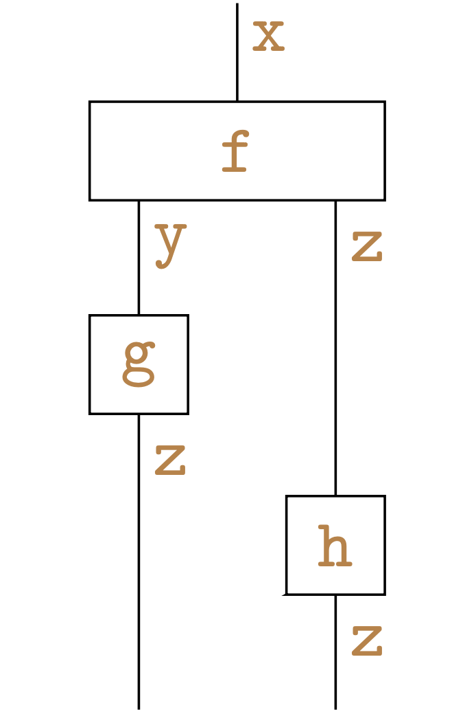
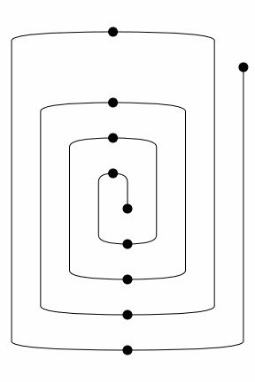
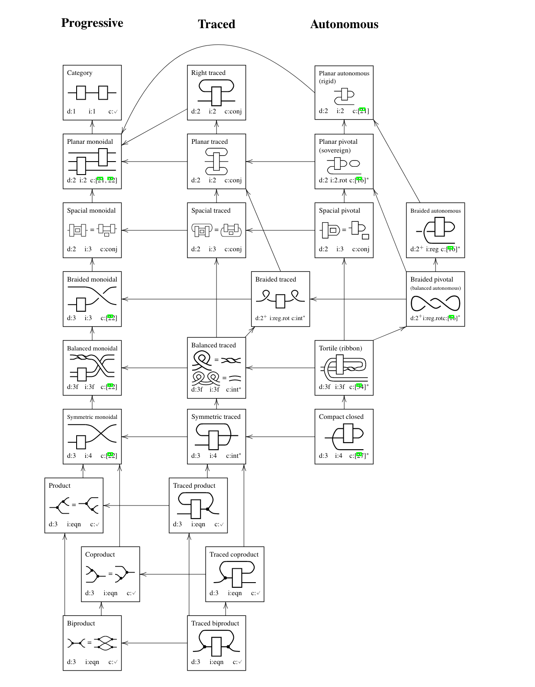
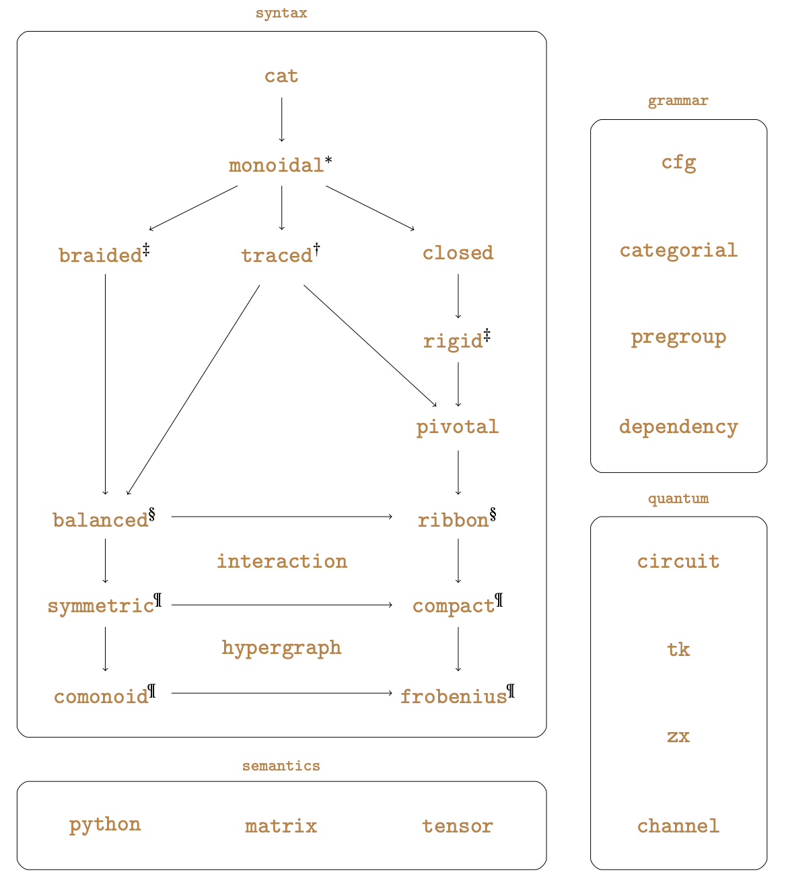
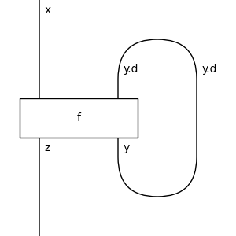
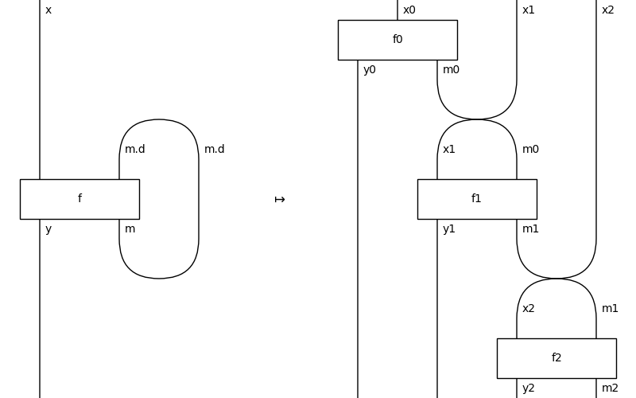
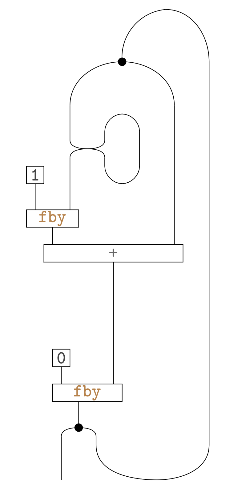
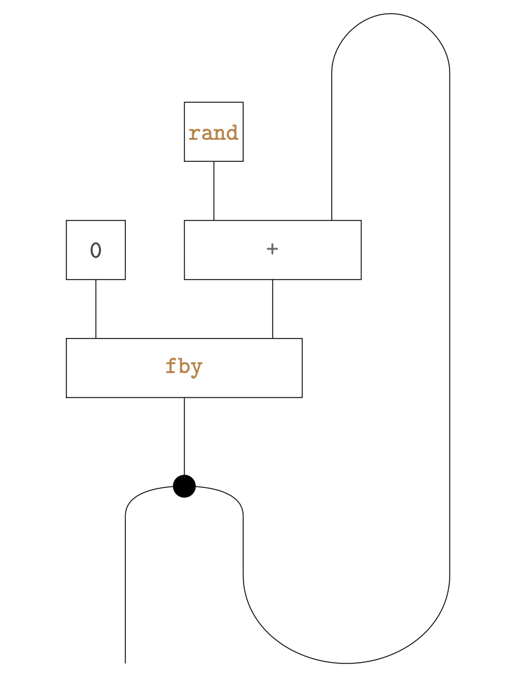

<style>
* { text-align: left; color: white; }
h1, strong, a { color: orange; font-weight: bold; text-decoration: none; }
img {
    display: block;
    margin-left: auto;
    margin-right: auto;
    background-color: white;
}
</style>

<style scoped>
* { text-align: center; }
li { text-align: left; }
</style>

# Monoidal Streams in DisCoPy

Alexis Toumi, Richie Yeung, Boldizsár Poór, **Giovanni de Felice**

June 19th 2024, ACT Oxford

1) Monoidal categories in Python: functions, matrices, tensors
2) Free monoidal categories in Python: string diagrams!
3) Feedback categories in Python
4) Monoidal streams over any monoidal category!

---

## What is a monoidal category?

```python
class Object:
  def tensor(self, other: Object) -> Object: ...

  def unit() -> Object: ...

class Morphism:
  def dom(self) -> Object: ...

  def cod(self) -> Object: ...

  @staticmethod
  def id(x: Object) -> Morphism: ...

  def then(self, other: Morphism) -> Morphism: ...

  def tensor(self, other: Morphism) -> Morphism: ...
```

---

## Example: Python

```python
class Function:
  inside: Callable
  dom: tuple[type, ...]
  cod: tuple[type, ...]
  ...

X, Y, Z = int, complex, bool

f = Function(lambda x: x + 1j,          X, Y)
g = Function(lambda z: abs(z) > 0,      Y, Z)
h = Function(lambda b: 42 if b else 24, Z, X)

equal_on_54 = lambda f, g: f(54) == g(54)

assert equal_on_54((f >> g) >> h, f >> (g >> h))
```

---

## Example: Matrix

```python
class Matrix:
  inside: numpy.ndarray
  dom: int
  cod: int
  ...

f = Matrix([[0, 1]],         1, 2),
g = Matrix([[0, 1], [1, 0]], 2, 2)
h = Matrix([[1], [0]],       2, 1)

assert (f >> g) >> h == f >> (g >> h)
```

---

## Example: Tensor

```python
class Dim:
  inside: tuple[int, ...]

class Tensor(Matrix):
  inside: numpy.ndarray
  dom: Dim
  cod: Dim

  def is_stochastic(self) -> bool: ...
```

Implementing a subcategory amounts to a boolean-valued method:
we get an implementation of the category $\mathbf{FinStoch}$!

---

## Duck typing


"If it walks like a duck and it quacks like a duck, it must be a duck"

"If it adds like a rig, and it multiplies like a rig then it must be a rig!"

```python
class Matrix(NamedGeneric["dtype"]):
  ...

assert Matrix[int].dtype != Matrix[bool].dtype
assert Matrix[int]([[0, 1]], 1, 2) != Matrix[bool]([[0, 1]], 1, 2)
```

We get the free biproduct completion with `Matrix[Morphism]`!

---

## Diagrams as a monoidal category

```python
class Ty:
  inside: tuple[str, ...] = ()

  def tensor(self, other: Ty) -> Ty:
    return Ty(self.inside + other.inside)

class Layer:
  left: Ty
  box: Morphism
  right: Ty

  def __matmul__(self, other: Ty) -> Layer:
    return Layer(self.left, self.box, self.right @ other)

  def __rmatmul__(self, other: Ty) -> Layer:
    return Layer(other @ self.left, self.box, self.right)
```
---

## Diagrams as a monoidal category

```python
class Diagram:
  inside: tuple[Layer, ...]
  dom: Ty
  cod: Ty
  
  @staticmethod
  def id(x: Ty) -> Diagram:
    return Diagram(x, x, ())
  
  def then(self, other: Diagram) -> Diagram:
    assert self.cod == other.dom
    return Diagram(self.dom, other.cod, self.inside + other.inside)
  
  def tensor(self, other: Diagram) -> Diagram:
    return self @ other.dom >> self.cod @ other
```

---

## Diagrams as a monoidal category

The main trick behind DisCoPy:

```python
class Box(Diagram):
  def __init__(self, name, dom, cod):
    self.name = name
    super().__init__((Layer(Ty(), self, Ty()), ), dom, cod)
  ...

x, y = Ty('x'), Ty('y')
f = Box('f', x, y)

assert f >> Diagram.id(y) == f == Diagram.id(x) >> f
```

---

## Drawing




```python
from discopy.monoidal import Ty, Box, Layer, Diagram

x, y, z = Ty('x'), Ty('y'), Ty('z')
f, g, h = Box('f', x, y @ z), Box('g', y, z), Box('h', z, z)

@Diagram.from_callable(x, z @ z)
def diagram(a):
  b, c = f(a)
  return (g(b), h(c))

assert diagram == f >> g @ h

diagram.draw()
```

---

## Interchangers

```python
def spiral(n_cups, x=Ty('x')):
  unit, counit = Box('unit', Ty(), x), Box('counit', x, Ty())
  cup, cap = Box('cup', x @ x, Ty()), Box('cap', Ty(), x @ x)
  result = unit
  for i in range(n_cups):
      result = result >> Id(x ** i) @ cap @ Id(x ** (i + 1))
  result = result >> Id(x ** n_cups) @ counit @ Id(x ** n_cups)
  for i in range(n_cups):
      result = result >>\
          Id(x ** (n_cups - i - 1)) @ cup @ Id(x ** (n_cups - i - 1))
  return result

Diagram.to_gif(*spiral(3).normalize())
```

- Delpeuch & Vicary, **Normalization for planar string diagrams and a quadratic equivalence algorithm** (2022)



---

## Functors

```python
class Category:
  ob: type
  ar: type

class Functor:
  cod: Category = Category(Ty, Diagram)
  ob: dict[str, cod.ob]
  ar: dict[Box, cod.ar]

  def __call__(self, other: Ty) -> cod.ob: ...

  def __call__(self, other: Diagram) -> cod.ar: ...
```

---

## Functors: example


```python
x, y, z = Ty('x'), Ty('y'), Ty('z')
f, g, h = Box('f', x, y @ z), Box('g', y, z), Box('h', z, z)

F = Functor(
  cod=Category(tuple[type, ...], Function)
  ob={x: (int, ), y: (complex, ), z: (bool, )}
  ar={f: lambda n: (n + 1, n > 0),
      g: lambda c: abs(c) > 0,
      h: lambda b: not b})

assert equal_on_54(F(f >> g @ h), F(f) >> F(g) @ F(h))
```

---


## The hierarchy of graphical languages



Selinger's [Survey on graphical languages for monoidal categories](https://arxiv.org/abs/0908.3347)

---

## The hierarchy of graphical languages



[DisCoPy: the Hierarchy of Graphical Languages in Python](https://arxiv.org/pdf/2311.10608) (ACT 2023)


---

## Feedback Diagrams



```python
from discopy.feedback import Ty, Box

x, y, z = map(Ty, "xyz")
Box('f', x @ y.delay(), z @ y).feedback().draw()
```

---

## Feedback Diagrams

```python
class Ty:
  inside: tuple[(str, int), ...]
  def delay(self) -> Ty: ...

class Feedback(Box):
  def __init__(self, arg: Diagram):
    self.arg = arg
    assert self.arg.dom[-1:] == self.arg.cod[-1:].delay()
    super().__init__("Feedback", self.arg.dom[:-1], self.arg.cod[:-1])

Diagram.feedback = lambda self: Feedback(self)

x, y, z = map(Ty, "xyz")
Box('f', x @ y.delay(), z @ y).feedback().draw()
```

---

## Monoidal Streams

```python
class Ty(NamedGeneric["base"]):
  base = Object

  now: base
  later: Callable[[], Ty[base]]

class Stream(NamedGeneric["category"]):
  category = Category(Object, Morphism)

  now: category.ar
  dom: Ty[category.ob]
  cod: Ty[category.ob]
  mem: Ty[category.ob]
  later: Callable[[], Stream[category]]
```

---

## Monoidal Streams



---

## Example: Fibonacci

```python
from discopy.feedback import *
from discopy.stream import Stream

X = Ty('X')
fby, wait = FollowedBy(X), Swap(X, X.d).feedback()
zero, one = Box('0', Ty(), X), Box('1', Ty(), X)
copy, plus = Copy(X), Box('+', X @ X, X)

@Diagram.feedback
@Diagram.from_callable(X.d, X @ X)
def fib(x):
    x = fby(zero.head(), plus.d(
      fby.d(one.head.d(), wait.d(x)), x))
    return (x, x)

F = Functor(
    ob={x: int},
    ar={zero: lambda: 0,
        one: lambda: 1,
        plus: lambda x, y: x + y},
    cod=stream.Category(python.Ty, python.Function))

assert F(fib).unroll(10).now() == (0, 1, 1, 2, 3, 5, 8, 13, 21, 34)
```



---

# Example: Random Walk

```python
from random import choice, seed; seed(420)
from discopy import stream, python
from discopy.feedback import *

X, fby = Ty('X'), FollowedBy(Ty('X'))
zero, rand, plus = Box('0', Ty(), X), Box('rand', Ty(), X), Box('+', X @ X, X)

@Diagram.feedback
@Diagram.from_callable(X.d, X @ X)
def walk(x):
    y = fby(zero.head(), plus.d(rand.d(), x))
    return (y, y)

F = Functor(
    ob={X: int},
    ar={zero: lambda: 0,
        rand: lambda: choice([-1, +1]),
        plus: lambda x, y: x + y},
    cod=stream.Category(python.Ty, python.Function))

assert F(walk).unroll(8).now() == (0, -1, 0, 1, 2, 1, 0, -1, 0, 0)
```



---

## Applications & Future Work

- Categorical Quantum Mechanics: unfolding photonic protocols
- Categorical Deep Learning: unrolling recurrent neural networks
- Categorical Game Theory: iterated games e.g. language games 

https://docs.discopy.org
